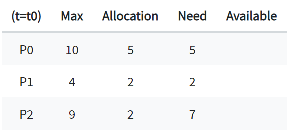
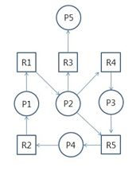

## 데드락(DeadLock), 교착상태란?

두 개 이상의 프로세스나 스레드가 서로 자원을 얻지 못해서 다음 처리를 하지 못하는 상태

무한히 다음 자원을 기다리게 되는 상태로, 시스템적으로 한정된 자원을 여러 곳에서 사용하려고 할 때 발생

## 예시

프로세스 1, 프로세스 2는 자원 1, 자원 2를 모두 얻어야 실행된다고 가정.

t1 : 프로세스 1이 자원 1을 얻음 / 프로세스 2가 자원 2를 얻음

t2 : 프로세스 1은 자원 2를 기다림 / 프로세스 2는 자원 1을 기다림

서로 원하는 자원이 상대방에게 할당되어 있기 때문에 두 프로세스는 무한정 대기 상태에 빠짐 >> DeadLock

## 발생 조건

!! 네 가지 조건 중 하나라도 성립하지 않는다면 데드락 발생 X !!

1. 상호 배제 (Mutual Exclusion)
자원은 한 번에 한 프로세스만 사용할 수 있음

2. 점유 대기 (Hold and Wait)
최소한 하나의 자원을 점유하고 있으면서 다른 프로세스에 할당되어 사용하고 있는 자원을 추가로 점유하기 위해 대기하는 프로세스가 존재해야함

3. 비선점(No Preemption)
다른 프로세스에 할당된 자원은 사용이 끝날 때까지 강제로 빼앗을 수 없음

4. 순환 대기(Circular Wait)
프로세스의 집합에서 순환 형태로 자원을 대기하고 있어야 함
EX) P0은 P1이 점유한 자원을 대기, P1은 P2가 점유한 자원을 대기 ..

---

## 해결 방법

**1. 예방 (Prevention)**
: 교착 상태 발생 조건 중 하나를 제거

- 상호배제 부정 : 여러 프로세스가 공유 자원 사용
- 점유대기 부정 : 프로세스 실행전 모든 자원을 할당
- 비선점 부정 : 자원 점유 중인 프로세스가 다른 자원을 요구할 때 가진 자원 반납
- 순환대기 부정 : 자원에 고유번호 할당 후 순서대로 자원 요구

    => 자원 낭비 심함

**2. 회피 (Avoidance)**
: 교착 상태 발생 시 회피, 자원을 할당한 후에도 시스템이 항상 안정 상태에 있을 수 있도록 할당하자는 개념

- 안정 상태(Safe State) : 시스템의 프로세스들이 요청하는 모든 자원을 차례로 모두에게 할당해줄 수 있는 상태
- 안전 순서(Safe Sequence) : 특정한 순서로 프로세스에게 자원을 할당/실행/종료할 때 데드락이 발생하지 않는 순서

[은행원 알고리즘(Banker's Algorithm)]
: 어떤 자원의 할당 허용 여부를 결정하기 전, 미리 결정된 모든 자원의 최대 가능한 할당량을 시뮬레이션하여 안정 상태에 들 수 있는지 검사하는 방법

- 은행에서 모든 고객의 요구가 충족되도록 현금을 할당하는데서 유래
- 프로세스가 자원을 요구할 때, 시스템은 자원을 할당한 후에도 안정 상태로 남아있게 되는지 사전에 검사하여 교착 상태 회피
- 안정 상태면 자원 할당, 아니면 다른 프로세스가 자원 해지할 때까지 대기

    - 시스템 자원 : 12개
    - P : 프로세스
    - MAX : 프로세스마다 최대 자원 요청량
    - Allocation : 현재 프로세스에 할당 중인 자원의 양
    - Need : 남은 필요한 자원의 양(MAX-Allocation)

    t0일 때 프로세스에 할당된 자원의 합은 5+2+2=9개

    현재 Available 자원은 12 - 9 = 3개

[Safe sequence]

    순서가  <P1, P0, P2> 일 때 안전 순서 만족

    - P1은 2개가 이미 할당되어 있고, 2개를 추가적으로 할당받기를(Need) 기다리고 있음.
    
    현재 Available 자원은 3개이므로, 이 중 2개를 P1에게 할당 
    => 현재 Available은 3 - 2 = 1개
    
    실행이 끝난 P1은 자신에게 할당되어 있던 자원 4개를 모두 반납 
    => 현재 Available은 1 + 4 = 5개
    
    현재 Available 자원이 5개, 이를 P0에게 모두 할당하면 P0도 실행 가능 
    => 현재 Available은 5 - 5 = 0개
    
    실행이 끝난 P0은 자신에게 할당되어 있던 자원 10개를 모두 반납
    => 현재 Available은 0 + 10 = 10개
     
    마지막으로 P2에게 자원 7개 할당 
    => 현재 Available은 10 - 7 = 3개
    
    실행이 끝난 P2는 자신에게 할당되어 있던 자원 9개 모두 반납
    => 현재 Available은 3 + 9 = 12개

이렇게 자원의 부족함 없이 올바르게 할당하여 모든 프로세스가 실행 가능.

**3. 탐지 및 회복**
: 교착 상태가 되도록 허용한 다음 회복시키는 방법

    => 대부분의 시스템은 데드락이 잘 발생하지 않으며, 이를 예방/회피/탐지/복구하는데에는 많은 비용 소요

1. 탐지(Detection)

    자원 할당 그래프를 통해 교착 상태를 탐지할 수 있음
    단, 자원 요청마다 탐지 알고리즘을 실행할 경우 그에 따른 오버헤드 발생

    

    P : 프로세스, R : 리소스(자원)

    - P → R : 해당 간선은 프로세스 Pi가 자원 Ri을 요청하는 것, 현재 Ri 자원을 기다리는 상태

    - R → P : 해당 간선은 자원 Ri가 프로세스 Pi에 이미 할당 된 것을 의미

**2. 회복(Recovery)**

교착 상태 일으킨 프로세스를 종료하거나, 할당된 자원을 해제시켜 회복시키는 방법

[프로세스 종료 방법]
- 교착 상태의 프로세스를 모두 중지
- 교착 상태가 제거될 때까지 하나씩 프로세스 중지

[자원 선점 방법]
- 교착 상태의 프로세스가 점유하고 있는 자원을 선점해 다른 프로세스에게 할당 (해당 프로세스 일시정지)
- 우선 순위가 낮은 프로세스나 수행 횟수 적은 프로세스 위주로 프로세스 자원 선점