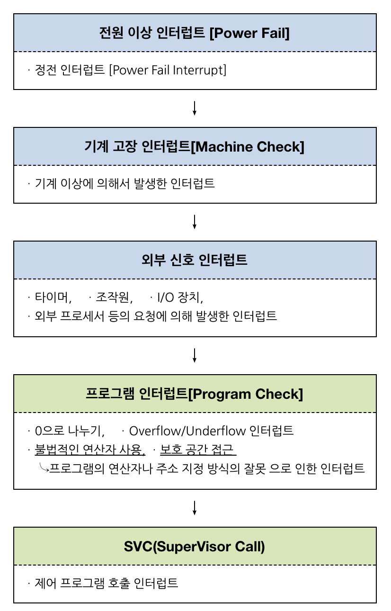
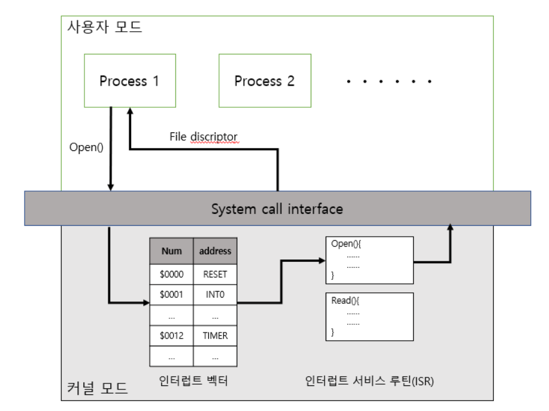

## 인터럽트(Interrupt)란?

> CPU가 프로그램을 실행하고 있을 때, 입출력 하드웨어 등의 장치에 예외상황이 발생하여 처리가 필요할 경우에 마이크로프로세서에게 알려 처리할 수 있도록 하는 것

즉, 프로그램 실행 도중 예기치 않은 상황이 발생하여 현재 실행 중인 작업을 일시 중단. 발생한 상황을 처리 후 실행 중이던 작업으로 복귀하여 작업을 이어나가는 것.

__**인터럽트 존재 이유?**__
주변장치와 입출력장치 관리를 위해.
입출력연산은 CPU 명령 수행속도보다 현저히 느린데, 고급 인력인 CPU가 이를 계속 기다리는 것은 비효율적이기 때문.

---

### 인터럽트 예시

CPU엔 인터럽트 라인이라는 인터럽트를 관리하는 곳 존재.
해당 라인에 신호가 들어오는지를 계속 체크하고 있음.

디스크에서 데이터를 읽어오는 작업을 진행 중임. 디스크 컨트롤러가 디스크에서 내용을 읽어서 로컬버퍼에 저장함. 이때 로컬 버퍼로 읽어오는 작업이 끝나면 컨트롤러가 CPU 인터럽트 라인에 인터럽트 신호 전달.

CPU는 하던 일을 멈추고 해당 인터럽트를 처리 후 본래의 업무로 복귀함.

- 컨트롤러 : 하드웨어마다 붙어있는 작은 CPU

- 로컬 버퍼 : 장치에 입출력되는 데이터를 임시로 저장하기 위한 작은 메모리

---

### 장치 종류

1. 외부 장치
키보드, 마우스, 모니터, 디스크 등의 장치
입출력 장치(I/O장치)라고도 함

2. 내부 장치
CPU, 메인메모리

---

### 인터럽트 종류

1. 하드웨어 인터럽트 (=외부 인터럽트=비동기 인터럽트)
하드웨어가 발생시키는 인터럽트로, 하드웨어 장치가 인터럽트 라인을 세팅하고 CPU에게 통보하는 방법.
하드웨어 장치가 CPU에 어떤 사실을 알려주거나 CPU 서비스를 요청해야할 경우 발생.
- 타이머 인터럽트 : 자원 할당 시간 종료
- I/O 인터럽트 : 입출력 장치가 데이터 전송/다음 동작 요구, 입출력 데이터 이상
- 전원 이상 인터럽트 : 정전, 파워 이상

2. 소프트웨어 인터럽트 (=내부 인터럽트=동기 인터럽트)
소프트웨어가 발생시키는 인터럽트로, 스스로 인터럽트 라인을 세팅함. 프로그램 오류에 의해 발생.
- Exception 인터럽트 (Trap) : 잘못된 명령어 혹은 잘못된 데이터
- SVC 인터럽트 : 복잡한 입출력 혹은 사용자가 감시프로그램 호출했을 때

인터럽트를 발생시키기 위해 하드웨어/소프트웨어는 CPU내 인터럽트 라인을 세팅해 인터럽트 발생시킴.
CPU는 매번 명령을 수행하기 전 인터럽트 라인 세팅되어 있는지 검사.

---

### 명령어 종류

1. 일반 명령
모든 프로그램이 수행할 수 있는 명령
메모리에서 자료를 읽어오고, CPU에서 계산을 하는 등의 명령

2. 특권 명령
운영체제만이 수행할 수 있는 명령
보안이 필요한 명령으로, 입출력장치와 타이머 등에 접근하는 명령

---

### 인터럽트 과정

1. 프로세스는 System Call을 통해 인터럽트 발생시킴
2. CPU는 현재 진행 중인 작업 정지
3. 수행중이었던 상태를 프로세스의 PCB(Process Control Block)에 저장(메모리 주소, 레지스터 값, 하드웨어 상태 등)
4. PC(Program Counter, IP)에 다음에 실행할 명령의 주소 저장
5. 인터럽트 벡터를 읽고 ISR 주소값을 얻어 ISR(Interrupt Service Routine)로 점프
6. 해당 코드 실행
7. ISR의 끝 IRET 명령어에 의해 인터럽트 해제
8. IRET 명령어가 실행되면, 대피시킨 PC 값을 복원하여 이전 실행 위치로 복원

---

### 용어 정리

- 인터럽트 벡터
: 인터럽트 종류마다 번호를 정해, 번호에 따라 처리해야할 루틴이 위치한 부분, 즉 루틴의 주소값을 가리키고 있는 자료구조

- 인터럽트 처리루틴 (ISR : Interrupt Service Routine)
: 인터럽트 핸들러라고도 하며, 실제 처리해야할 코드.
여러가지 인터럽트에 따라 각각 처리할 업무를 정의해놓은 것

- IRET 명령어 : 이전 업무로 다시 돌아가는 어셈블리 명령어로, ISR의 마지막에 위치.