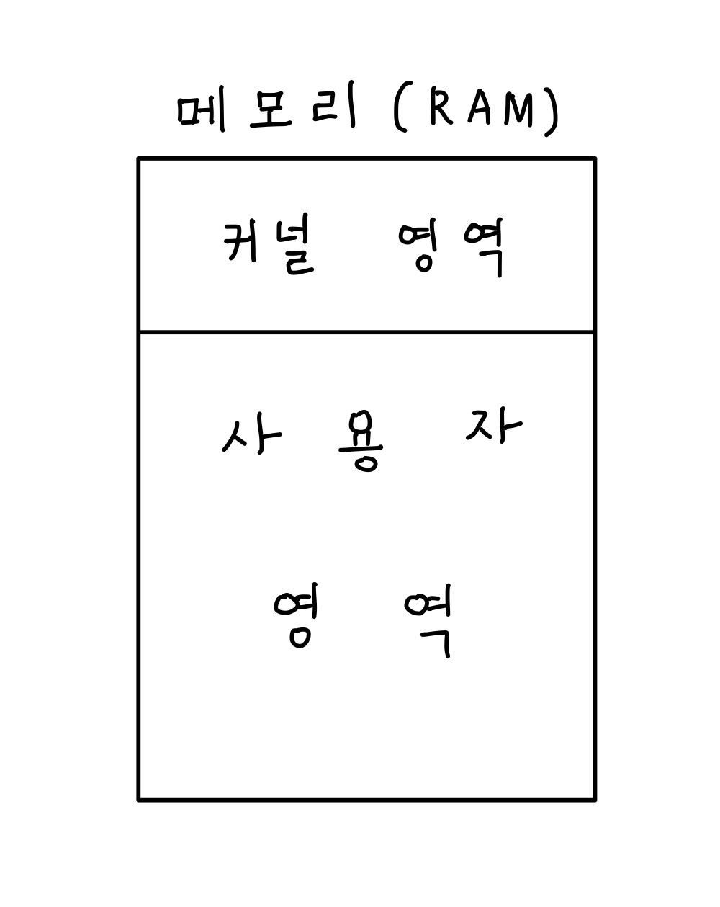
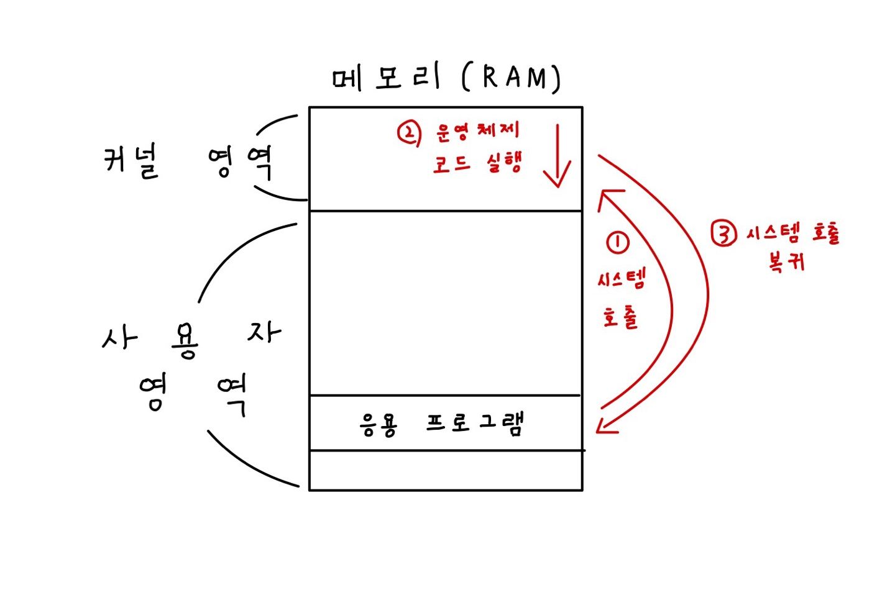

# OS(Opterating System)

- 모든 프로그램은 하드웨어를 필요로한다.
- 이러한 하드웨어들이 프로그램에서는 시스템자원 or 자원이라 부른다
- 프로그램이 실행되려면 반드시 자원이 필요한다
- OS란 실행할 프로그램에 자원을 할당하고, 프로그램이 올바르게 실행되도록 돕는 프로그램

## 커널(kernel)

- 운영체제의 심장
- 운영체제가 설치된 모든 기계에는 커널이 있다.
- 자원에 접근, 조작하는 핵심서비스의 기능이 들어있는 영역이다.
  
## 운영체제의 목적
### 운영체제의 성능을 평가하는 기준

- 처리능력(Throughput) : 일정 시간 내 시스템이 처리하는 일의 양
- 반환시간(Turn Around Time) : 시스템에 작업을 의뢰한 시간부터 처리완료까지 걸린 시간
- 사용가능도(Availability) : 시스템을 사용할 필요가 있을 때 즉시 사용 가능한 정도
- 신뢰도(Reliabilty) : 시스템이 주어진 문제를 정확하게 해결하는 정도

 ## 운영체제의 기능
- 프로세스 관리
- 자원 접근 및 할당
- 파일 시스템 관리
- GUI, CLI 형식의 UI 기능 제공  

## 이중모드
- CPU가 명령어를 사용하는 모드를 사용자 모드와 커널 모드로 나눈 것
  
### 커널 모드
- 운영체제 서비스를 받을 수 있는 실행 모드
- 커널영역에 코드를 실행할 수 있다.
- 커널모드를 통해 시스템 자원에 접근할 수 있다

### 사용자 모드
- 운영체제 서비스를 받을 수 없는 실행 모드
- 일반적인 응용 프로그램들은 모두 사용자 모드에서 실행된다.

## 시스템 호출

- 일종의 일터럽트
- 사용자 모드로 실행되는 응용 프로그램이 운영체제 서비스를 받기위해 보내는 호출
- 소프트웨어 인터럽트라고도 한다.