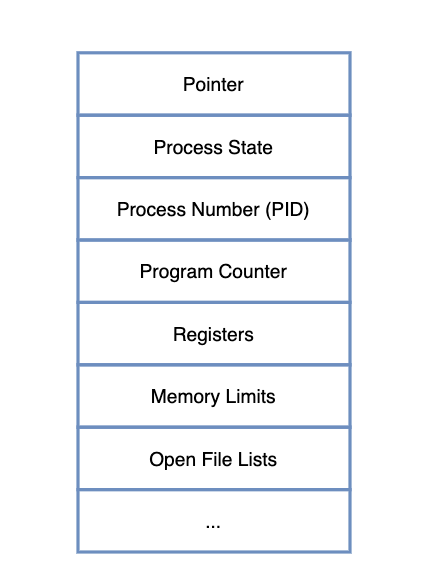

## 프로세스 관리

구동중인 프로세스가 여러 개일 때, CPU 스케줄링을 통해 프로세스를 관리하는 것. 

CPU 들은 각 프로세스들에 대해서 구분할 수 있어야 함. 

따라서 각각 프로세스 본연의 특징을 가진 Process Metadata 라는 정보 활용

### 프로세스 메타데이터

- 프로세스 고유 ID (PID) : 프로세스 고유 식별 번호
- 프로세스 상태 : 프로세스의 현재 상태(준비, 실행, 대기) 기억
- 프로세스 우선순위 : 우선순위 같은 스케줄링 관련 정보 기억
- Program Counter(PC) : 다음 실행되는 명령어의 주소 기억
- CPU 레지스터 : 프로세스의 레지스터 상태 저장
- Owner : 계정정보로, CPU 사용시간이나 각종 스케줄러이 필요한 정보 기억
- Memory Limit : 프로그램이 적재될 기억 장치에 대한 정보 기억
- 기타 등등

**메타데이터는 프로세스가 생성될 때마다 PCB에 저장됨**

## PCB(Process Control Block)이란?

프로세스들의 메타데이터를 저장하는 곳

하나의 PCB 안에는 한 프로세스의 정보가 담김

1. 프로그램 실행되어 메모리에 적재 완료
2. 프로세스가 생성
3. 프로세스 주소 공간에 코드/데이터/스택 공간 생성
4. 해당 프로세스의 메타데이터들이 PCB에 저장됨

---

### PCB의 목적

CPU 에서는 프로세스의 상태에 따라 프로세스 교체작업이 이루어짐.

만약 어떤 프로세스로부터 인터럽트가 발생하면 현재 프로세스는 대기 상태가 됨.

인터럽트 발생된 프로세스를 실행 상태로 둘 때 대기 중인 프로세스의 정보를 잃어버리면 프로그램을 처음부터 다시 시작해야 함.

따라서 대기 상태로 바뀌기 직전 실행 정보를 고스란히 저장해둔다면 다시 실행 상태로 돌아왔을 때 문제가 발생하지 않음.

이 동작을 위해 PCB가 필요.

---

### PCB 관리 방식

하나의 프로세스마다 하나의 PCB가 생성됨.

프로세스가 생성될 때마다 PCB가 늘어나게 되므로, PCB를 관리하는 구조 또한 필요함.

해당 자료구조는 Linked List 형태로, PCB List Head 에 PCB 들이 생성될 때마다 하나씩 이어붙게 됨.

주소값으로 연결되는 형태이기 때문에 삽입 삭제 연산에서 효율적임.

---

## Context Switching란?

위에서 언급한 프로세스 교체작업, CPU의 레지스터 정보가 변경되는 것을 바로 Context Switching라고 함.

원래 실행중이던 프로세스의 상태를 PCB에 보관하고, 새로 들어오는 프로세스의 PCB 정보를 바탕으로 레지스터에 값을 적재하는 과정

다르게 말한다면, 다중 프로그래밍 시스템에서 CPU가 할당되는 프로세스를 변경하기 위한 작업임. 현재 CPU를 사용하여 실행되고 있는 프로세서의 상태 정보를 저장. 제어권을 인터럽트 서비스 루틴(ISR)에게 넘기는 작업을 의미.

__Context란__ 
: CPU가 다루는 작업에 대한 정보를 의미하며, 대부분의 정보는 Register에 저장 후 PCB로 관리됨.

### Context Switching 목적

하나의 컴퓨터가 매번 하나의 작업만을 처리할 수 있다면, 실시간 처리가 불가능하고 반응속도가 매우 느리기 때문에 사용이 불편함

컴퓨터 멀티태스킹을 통해 다양한 사람들이 동시에 사용하는 듯한 효과를 줌

---

### 발생 상황

- 인터럽트 발생
- 현재 프로세스의 사용 허용 시간 모두 소모
- 입출력을 위해 대기할 때

---

### Context Switching Overhead

Context Switching이 발생하는 동안, CPU는 다른 작업을 수행할 수 없음.

따라서 만일 thread 및 process 개수가 매우 많아져 Context Switching이 빈번히 일어나게 된다면, 많은 오버헤드가 발생함.

이는 성능 악화로 이어지게 되며 Context Switching Overhead라고 부름.

__Context Switching에 소요되는 비용은 얼마일까?__
1. 캐시 초기화
2. Memory Mapping 초기화
3. 메모리 접근을 위해 커널 항상 실행

=> 따라서 잦은 Context Switching은 성능 저하를 발생시킴