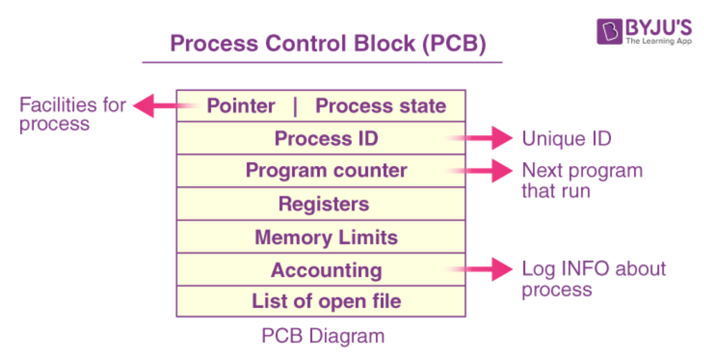
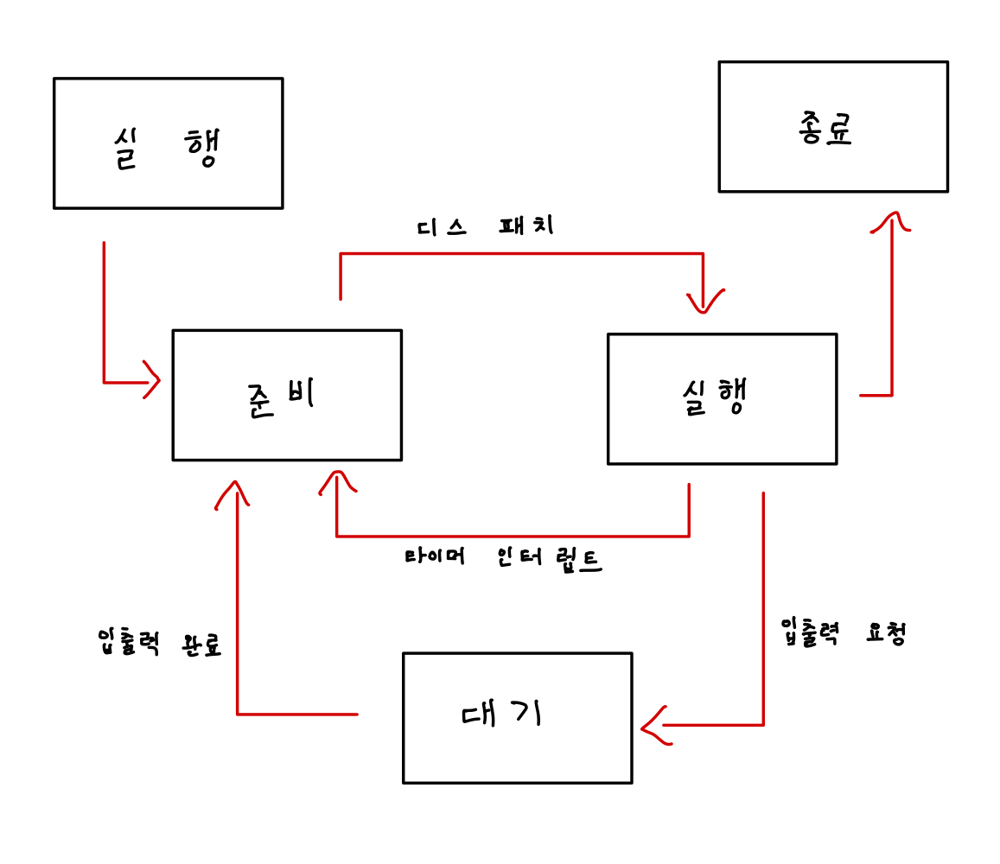

# PCB(Process Control Block)

- 프로세스 제어 블록
- 프로세스의 정보를 저장하는 운영체제 커널의 자료구조
- CPU는 PCB의 내용을 확인하여 빠르게 프로세스의 정보를 확인할 수 있다.
- 모든 프로세스는 PCB를 가지고 있다.

## PCB 구성 정보
1) 프로세스 식별자(Process ID) 
   - 프로세스 식별을 위한 고유 번호
   - 같은 일을 하더라는 2개의 프로그램을 실행시켜도 서로 다른 PID가 생성

2) 프로세스 상태(Process State) 
   - 생성(create) : 메모리에 적재되고 PCB를 할당 받은 상태
   - 준비(ready) : CPU할당이 가능하지만 순서를 기다리는 상태
   - 실행(running) : CPU를 할당받고 프로그램 실행
   - 대기(waiting) : 입출력 작업을 위해 실행 중이던 프로세스는 대기 후 다시 준비 단계를 거침
   - 완료(terminated) : 프로세스가 종료된 상태, 종료 후 PCB와 메모리에서 정리 
   
3) 프로그램 계수기(Program Counter)
    - 프로세스가 다음에 실행시킬 명령어의 주소를 가르킨다
  
4) CPU 레지스터 및 일반 레지스터
   - CPU 레지스터 :프로세서가 명령어를 실행하기 위해 필요한 정보를 보관
   - 일반 레지스터 : 연산에 필요한 데이터를 임시로 저장
  
5) CPU 스케줄링 정보 
    - 스케줄링 정보, 우선 순위 등 

6) 메모리 관리 정보 
    - 해당 프로세스의 주소 공간 등
  
7) 프로세스 계정 정보 
    - 페이지 테이블, 소유자, 부모 등

8) 입출력 상태 정보 
    - 프로세스에 할당된 입출력 장치  열린 파일 목록 등

9)  포인터 
    - 부모, 자식 프로세스에 대한 포인터
    - 프로세스가 위치한 메모리 주소에 대한 포인터
    - 할당된 자원에 대한 포인터 정보 등
