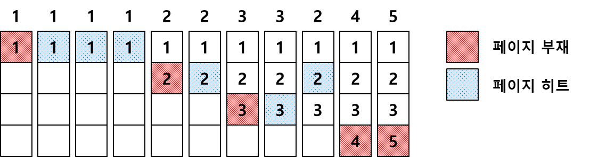
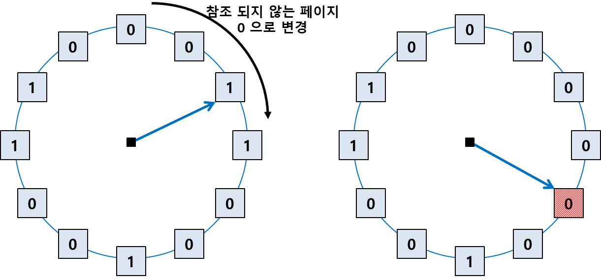

## 페이지 교체 알고리즘이란?

페이징 기법으로 메모리를 관리하는 운영체제에서 요청을 보낸 페이지가 주기억장치에 적재되어있지 않았을 경우 페이지 부재(Page Fault)가 발생.

이 경우에 어떤 프레임을 선택하여 페이지를 교체할 것인지 결정하는 방법.

## 목적
- 페이지 부재 최소화
- 시스템 성능 향상

## 종류

[이론적 알고리즘]
- OPT(Optimal) : 앞으로 가장 오랫동안 사용되지 않을 페이지를 교체

[간단한 알고리즘]
- FIFO(First In First Out) : 가장 처음 들어온 페이지를 교체

[최적 근접 알고리즘]
- LRU(Least Recently Used) : 가장 오랫동안 사용되지 않은 페이지를 교체
- LFU(Least Frequently Used) : 참조 횟수가 가장 적은 페이지를 교체
- MFU(Most Frequently used) : 참조 횟수가 가장 많은 페이지를 교체
- NUR(Not Used Recently, NRU, 클럭) : 최근에 사용하지 않은 페이지를 교체

## OPT(Optimal)

- 앞으로 가장 오랫동안 사용되지 않을 페이지를 대상 페이지로 선정해 교체
- 가장 이상적인 알고리즘
- 프로세스가 앞으로 사용할 페이지를 미리 알아야 함, 하지만 이는 불가능에 가까운 일이므로 이론적으로만 존재하는 알고리즘임
- 실제 사용보단 비교 연구 목적을 위함

## FIFO(First in First out)

- 물리메모리에 가장 먼저 들어온 페이지를 대상 페이지로 선정해 교체
- 들어온 시간을 저장하거나 올라온 순서를 큐에 저장

[장점]
- 구현이 쉬움

[단점]
- 페이지의 향후 참조 가능성을 고려하지 않기 때문에 성능은 좋지 않음
- Belady's Anomaly(FIFO anomaly) 현상 발생할 수 있음

[Belady's Anomaly란?]

- 프레임의 개수가 많아져도 페이지 부재가 줄어들지 않고 늘어나는 현상
- 직관적으로 생각했을 때 프레임의 개수가 많아진다면 페이지 결함이 줄어야함
- FIFO 알고리즘의 경우의 그렇지 않을 수 있음

## LRU(Least Recently Used)

- 가장 오랫동안 사용하지 않은 페이지를 대상 페이지로 선정해 교체
- "가장 오랫동안 사용하지 않았던 페이지라면 앞으로도 사용할 확률이 적을 것이다."라는 가정을 따름
- 시간 지역성(temporal locality)성질 고려
  (최근에 참조된 페이지가 가까운 미래에 다시 참조될 가능성이 높은 성질)
- 사용된 시간을 알수있는 부분을 저장하여 가장 오랫동안 참조되지 않는 데이터를 제거(페이지마다 카운터 필요)

[장점]
- 성능이 좋은 편으로 많은 운영체제가 채택하는 알고리즘임

[단점]
- 프로세스가 주기억장치에 접근할때마다 참조된 페이지 시간을 기록해야 하므로 막대한 오버헤드가 발생
- 카운터나 큐, 스택과 같은 별도의 하드웨어가 필요
* 카운터 : 각 페이지별로 존재하는 논리적인 시계(Logical Clock)로, 해당 페이지가 사용될때마다 0으로 클리어 시킨 후 시간을 증가시켜 시간이 가장 오래된 페이지를 교체

## LFU(Least Frequently Used)

- 참조 횟수가 가장 적은 페이지를 교체
- 만약 교체 대상이 여러 개라면 가장 오랫동안 사용되지 않은 페이지를 선정

[종류]
- Incache-LFU: 메모리에 적재될 때부터 페이지의 횟수를 카운트 하는 방식
- Perfect-LFU: 메모리 적재 여부와 상관 없이 페이지의 과거 총 참조 횟수를 카운트 하는 방식

[장점]
- LRU는 직전 참조된 시점만을 반영하지만, LFU는 참조횟수를 통해 장기적 시간규모에서의 참조 성향 고려할 수 있음

[단점]
- 가장 최근에 불러온 페이지가 교체될 수 있음 -> 최신 흐름 잘 반영하지 못할 수 있음
- 구현이 더 복잡함
- 막대한 오버헤드가 발생할 수 있음

## MFU(Most Frequently used)

- 참조 횟수가 가장 많은 페이지를 교체
- "가장 많이 사용된 페이지가 앞으로는 사용되지 않을 것이다" == "적게 사용된 페이지는 최근에 참조된 것이라고 생각, 앞으로 사용될 가능성이 높을 것이다"라는 가정을 따름

## NUR = NRU(Not Used Recently, Not Recently Used), 클럭 알고리즘

- 최근에 사용하지 않은 페이지 교체 (LRU 근사 알고리즘)
- 하드웨어적인 자원을 통해 기존 LRU의 소프트웨어적인 운영 오버헤드를 줄인 방식

[알고리즘]
- 각 페이지마다 참조 비트(Reference Bit)와 변형 비트(Modified Bit, Birty Bit)가 사용됨
- 참조 비트(R): 페이지가 참조되지 않았을 때 0, 호출되었을 때 1 (모든 참조비트를 주기적으로 0으로 변경)
- 변형 비트(M): 페이지 내용이 변경되지 않았을 때는 0, 변경되었을 때 1
- 우선순위:참조비트 > 변형비트
- 즉, 교체 우선 순위는 아래와 같음
    1. R=0, M=0
    2. R=0, M=1
    3. R=1, M=0
    4. R=1, M=1

[기존 알고리즘]
1. 교체될 페이지를 찾을 때까지 포인터는 시계 방향으로 한칸씩 이동
2. 만약 참조 비트가 1이라면 해당 참조 비트는 0으로 변경
3. 만약 참조 비트가 0이라면 해당 페이지를 교체
4. 만약 한 바퀴를 돌았다면, 그 이후 다시 만났을 때도 여전히 참조 비트가 0인 페이지를 변경

=> 시곗바늘이 한 바퀴 도는 데 소요되는 시간만큼 페이지를 메모리에 유지시켜둠으로써 페이지 부재율을 줄이도록 설계되었기 때문에 
2차 기회 알고리즘이라고도 부름

[변형비트가 추가된 알고리즘]

: 참조비트와 변형비트에 따라 4가지 유형의 프레임으로 구분
1. R=0, M=0상태를 가진 페이지 선택
2. 단계 1 실패시 R=0, M=1을 가진 페이지 선택
3. 단계 2 실패시 위의 두 단계 반복

[LRU와의 차이점]
- 교체되는 페이지의 참조 시점이 가장 오래되었다는 것을 보장하지는 못함

[장점]
- 적은 오버헤드로 적절한 성능

[단점]
- 동일 그룹 내에서 선택 무작위