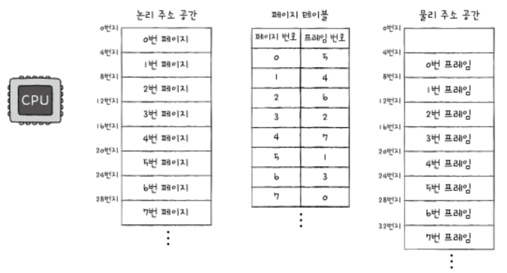

# 페이징 기법(Paging)
- 가상 메모리를 물리 메모리로 매핑하는 메모리 관리 기법 중 하나
- 오늘 날까지 사용 중인 메모리 관리 기법
- 외부 단편화의 문제를 해결하기 위한 방법
- 프로세스의 논리주소를 페이지, 메모리의 물리주소 공간을 프레임 단위로 자른 후 적재 
  
## 페이징 기법을 왜 사용하는가?

- 연속 메모리 할당 방식에서 생기는 외부 단편화 문제를 해결하기 위해
- 각 기 크기가 다른 프로세스들을 효율적으로 적재하기 위해
 

- 페이징 기법을 통해 사진과 같이 메모리를 효율적으로 관리할 수 있다.

## Page Table

- 메모리에 불연속으로 할당되면서 CPU에서 순착적으로 실행이 불가능
- CPU가 '다음에 실행할 명령어를 가르키는 이정표'
- 물리주소는 불연속이어도 논리 주소는 페이지 테이블의 연속으로 할당
- 모든 프로세스는 페이지 테이블를 가지고 있으며, PCB에 저장된다.
- CPU내에는 페이지 테이블의 주소를 가르키는 PTBR(Page Table Base Register)가 존재

### 페이지 테이블의 문제점
- 페이지 테이블을 찾기 위한 메인 메모리 접근 1번, 실제 메모리 읽기 위해 1번 총 2번의 접근
- 즉 메모리의 접근 시간이 2배로 늘어남

## TLB

- CPU 곁에 (일반적으로 MMU)있는 페이지 테이블의 캐시메모리
- 참조 지역성에 근거해 최근에 사용한 페이지를 TLB에 적재
- CPU가 발생한 논리 주소에 대한 페이지 번호가 TLB에 있으면 TLB히트, 반대시 TLB미스
- TLB미스일 경우 2번의 접근을 통해 확인

## 페이징에서 주소 변환

### 특정 주소로 접근하기 위해 필요한 2가지 정보
- 어떤 페이지 or 프레임에 접근하고 싶은가
- 접근하려는 주소가 페이지 or 프레임으로부터 얼마나 떨어져있는가

- 위 2가지의 정보를 담기 위해 페이징의 논리 주소는 페이지 번호와 변위로 이루어져있다.

ex) 논리주소 <5, 2> 를 통해 접근하는 주소는 10번지

## 추가로 확인해볼 내용
- 내부 단편화
- 페이지 테이블 엔트리
- 스와핑 학습 후 페이지인 & 페이지 아웃