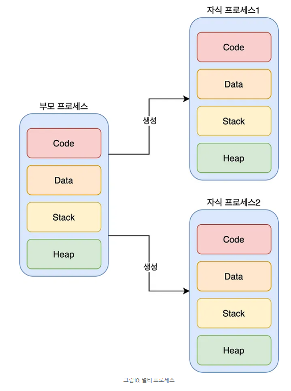
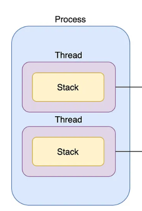

## 키워드

- 실행 단위 : cpu core에서 실행하는 하나의 단위로 프로세스와 스레드를 포괄하는 개념
- (부연 설명이 없는) 프로세스 : 하나의 스레드만 가지고 있는 단일 스레드 프로세스
- 동시성 : 한 순간에 여러가지 일이 아니라, 짧은 전환으로 여러가지 일을 동시에 처리하는 것처럼 보이는 것
- 프로그램 : 어떤 작업을 위해 실행할 수 있는 (코드)파일

## 프로그램 > 프로세스?
1. 프로세스가 필요로 하는 자원이 메모리에 올라가야 함

메모리 영역
- Code : 실행 명령을 포함하는 코드들
- Data : Static 변수 혹은 Global(전역) 변수
- Heap : 동적 메모리 영역
- Stack : 지역변수, 매개변수, 반환 값 등 일시적인 데이터

2. 프로세스 생성시 프로세스에 대한 정보를 담은 PCB 블록이 함께 만들어짐
- PID
- Program Counter 등

## 프로세스(Process)란?

> 컴퓨터에서 연속적으로 실행되고 있는 프로그램

- 메모리에 올라와 실행되고 있는 프로그램의 인스턴스 (독립적인 개체)
- 운영체제로부터 시스템 자원을 할당받는 작업의 단위
- 즉, 동적인 개념으로 실행된 프로그램을 의미

## 스레드(Thread)란?

> 프로세스 내에서 실행되는 여러 흐름의 단위

- 경량화된 프로세스
- 하나의 프로세스에 대해 Code, Data, Heap 영역을 공통된 자원으로 사용하기 때문
- 각 Thread는 스택 부분만을 따로 가지고 있음

---

## Multi-Process VS Multi-Thread

- 한 어플리케이션에 대한 두 가지 **처리 방법**
- SW분야와 친밀

### 멀티 프로세스(Multi-Process)란?

- 하나의 프로세스는 하나의 일만 처리할 수 있기 때문에 여러 요청을 한 번에 처리하기 위해 자식 프로세스를 이용
- 자식 프로세스는 부모와 별개의 메모리 영역을 확보

[특징]
- 각 프로세스는 독립적
- IPC를 사용한 통신
- 자원 소모적, 개별 메모리 차지
- Context Switching 비용이 큼
- 동기화 작업이 필요하지 않음

### 멀티 스레드(Multi-Thread)란?

- 하나의 프로세스 내에서 구분이 지어진 실행 단위
- 한 어플리케이션에서 작업의 단위가 나누어지는 것

[특징]
- Thread끼리 긴밀하게 연결되어 있음
- 공유된 자원으로 통신 비용 절감
- 공유된 자원으로 메모리가 효율적임
- Context Switching 비용이 적음
- 공유 자원 관리 해야함

Q. 멀티 스레드가 훨씬 좋아보이는데, 어떤 경우에 멀티 프로세스를 사용할까?

A. 만약 여러 개의 탭에 중요한 정보들을 띄워놓고 작업하다가, 오류가 발생한다면 전체 탭이 종료됨. 긴밀하게 연결이 되어있기 때문에 하나의 탭에라도 문제가 생기면 전체의 과정에 영향을 미침.

---

## Multi-core

- HW분야와 친밀
- 병렬처리와 연관

[동시성 vs 병렬처리]
- 동시성 : 하나의 core를 사용하지만 짧은 순간에 cpu 시간을 분할해 동시에 진행하는 것처럼 보이게 함
- 병렬 처리 : 물리적으로 여러 개의 core를 사용해 다수의 실행 단위를 한순간에 처리할 수 있게 함 > 다수의 프로세서로 여러 가지 일을 각 core에서 진행하는 것

