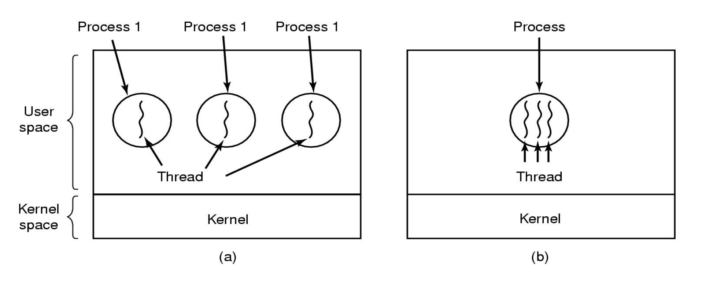

# Process VS Thread

## 1. Process VS Thread

- Process : 운영체제로부터 자원을 할당받은 **작업**의 단위

- Thread : 프로세스가 할당받은 자원을 이용하는 **실행 흐름**의 단위

## 2. Program

- Program : 파일이 저장 장치에 저장되어 있지만 메모리에는 올라가 있지 않은 정적의 상태이다.
    
    - **디스크에 저장되어 있는 실행 가능한 형태의 파일**을 말한다. (executable file on a disk)
    
    - 메모리에 올라가 있지는 않지만(= 실행 이전) 언제든지 loader에 의해 메모리에 올라갈 수 있는 binary code이다. (loaded into memory and executed by the kernel)
    
    - 즉, **program은 아직 실행되지 않은(메모리에 올라가지 않은) 파일**을 말하는 것이다. 윈도우의 .exe 파일이나 macOS의 .dmg 파일 등 사용자가 눌러서 실행하기 전의 파일을 말한다.

## 3. Process

- Process : **Program이 memory에 올라가면(= 실행되면) process**라고 한다.

    - 실행 가능한 형태의 파일(program)이 memory에 올라가서 program counter가 가리키는 상태가 되면 실행 중이라고 하고 이러한 실행 중인 것을 process라고 한다.

    - Process는 스케줄링과 실행의 기본 단위이다. (사실 process보다 더 기본적인 단위로 이후에 나올 thread가 있다)

    - Program이 실행되면 loader에 의해 program의 복사본이 만들어지게 되고, CPU 연산들의 집합으로 이루어진 binary code를 메모리에 그대로 복사하여 하나의 메모리 형태를 구성한다. 이를 하나의 instance라고 한다. 즉 process는 program이 실행되는 instance라고 할 수 있다.

    - Process는 program에서의 코드의 흐름(flow of control)을 캡슐화(encapsulation)한 것이다.

### (1) Program VS Process

- 실행 이전의 실행 가능한 형태의 파일인 **program은 static**하다는 특징을 가진다. 반면, **process는 실행 중인 것으로 dynamic하고 active한 entity**라는 특징이 있다.

### (2) PID (Process ID)

- PID (Process ID) : **운영체제가 process를 구별하고 관리하기 위해 각 process에게 부여하는 고유한 ID 값**이다.

- 모든 Process는 고유한 PID 값을 가지며, 서로 다른 process끼리 중복된 PID 값을 가질 수 없다.

- 참고로 윈도우에서 pid = 0을 가지고 있는 process는 IDLE process이다. 리눅스 기준 pid = 1을 가지고 있는 process는 init process이다.

## 3. Thread

### (1) 배경

- 과거에는 program을 실행할 때 실행 시작부터 실행 끝까지 process 하나만을 사용해서 진행했다.

- 하지만 시간이 흐를수록 program이 복잡해지게 되면서 process 하나만을 사용해서 program을 실행하기는 힘들어지게 되었다.

- 이를 해결하기 위해 multi-process 방식 또는 multi-thread 방식을 이용할 수 있다.

### (2) Thread

- Thread : Process의 코드에 정의된 절차에 따라 실행되는 특정한 **수행 경로**다.

- Multi-process 방식에서 발생하는 문제들을 해결하기 위해 **process보다 더 작은 개념, 더 가벼운 개념**으로 thread를 도입하게 되었다.

- 하나의 program 내에서 path만 분리할 수 있도록 하는 아이디어로 썬마이크로시스템즈의 LWP(lightweight process)가 만들어지게 되었으며, 이후 이러한 code의 흐름이 실처럼 생겼다고 표현하여 thread라는 이름으로 부르게 되었다.

### (3) Multi-Process VS Multi-Thread

- Multi-process와 Multi-Thread 모두 multi path, **여러 개의 path를 구현한다는 공통점**이 있다.

- **Multi-process는 process마다 실행 path가 하나씩** 있고(single thread), fork()를 통해 동일한 process를 하나 더 만들어서 **여러 개의 process**가 돌아가고, 이러한 여러 개의 process들을 kernel에서 관리해주는 방식이다.

- 반면, **multi-thread는 하나의 process 안에 여러 개의 실행 path(thread)**가 있어서 **각 thread가 parallel하게 동작**하는 방식이다.

- Multi-process에서는 fork()를 통해 운영체제가 새로운 process를 만들고 초기화와 데이터 세팅 과정을 다 거친 다음에 ready queue에 들어가서 scheduler에 의해 scheduling이 되기까지 걸리는 시간이 존재하므로 overhead가 커진다는 단점이 있다.

- 또한 multi-process에서는 각각의 실행 path들이 서로 협력을 하기 위해서는 IPC(Inter-Process-Communication) 방식을 거쳐야 하므로 이에 대한 overhead가 생긴다는 단점이 있다.

- 반면, **multi-thread에서는** 여러 개의 process로 나누어져 있지 않으므로 scheduling의 대상이 줄어들게 되어서 이와 관련된 **overhead가 줄어들게 되고 해당 process의 차례(실행 순서)가 훨씬 더 많이 돌아오게 된다는 장점**이 있다.

- 또한 multi-thread에서는 kernel의 개입 없이 하나의 process 내에서 협력하여 작업을 처리할 수 있으므로 **context switch가 줄어들게 되어 overhead가 감소한다는 장점**이 있다.

- **Multi-process에서는** 두 개의 process가 fork() 이후로 다르게 분기되기는 하지만 결국 같은 코드를 가지고 있게 되므로 **multi-thread에 비해 code를 더 많이 포함하게 되고, 따라서 무거워진다는 단점**이 있다.

- 반면 multi-thread 방식을 이용할 경우, 하나의 process 내에서 execution path를 여러 개로 두면 fork()를 사용하는 것보다 훨씬 더 가볍게 동작하면서도 multi-process와 비슷하게 프로그램을 작성하고 실행할 수 있다는 장점이 있다.
