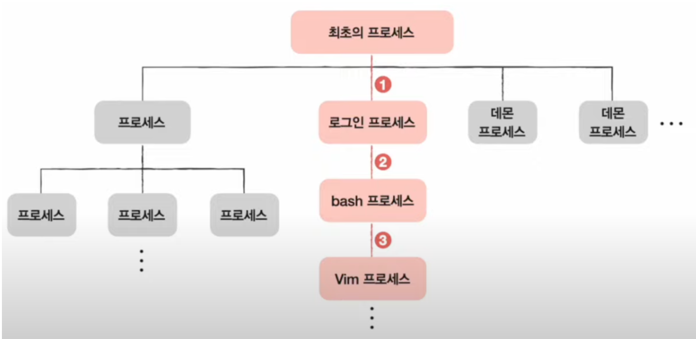
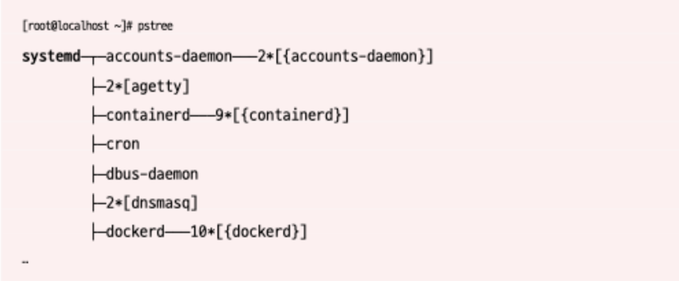
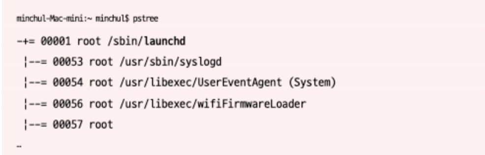
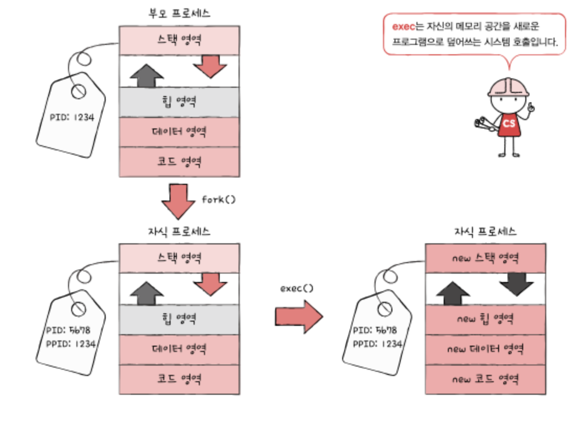

# 프로세스 계층 구조

- Process_Hierarchy
- 프로세스는 실행 도중 시스템호출을 통해 다른 프로세스를 생성할 수 있다.
- 운영체제는 모든 프로세스를 계층 구조로 관리한다
- 자식 프로세스는 부모 프로세스의 PID, 즉 PPID값을 가진다.

## 최초의 프로세스란?
- 유닉스 : init
- 리눅스 : systemd
- Mac OS: launched
- 최초의 프로세스의 PID는 항상 1번
- pstree 명령어를 통해 프로세스 계층 상태를 확인 가능
  
### 리눅스에서 최초의 프로세스 확인

### Mac OS에서 최초의 프로세스 확인

## 프로세스 생성 기법

- 프로세스의 생성은 복제와 덮어씌기
- fork()라는 시스템 호출을 통해서 자식 프로세스를 생성
- 생성된 자식 프로세스는 exec() 시스템 호출에 의해 데이터가 덮어씌워진다
- 생성된 자식 프로세스는 부모 프로세스의 자원들을 상속받는다.