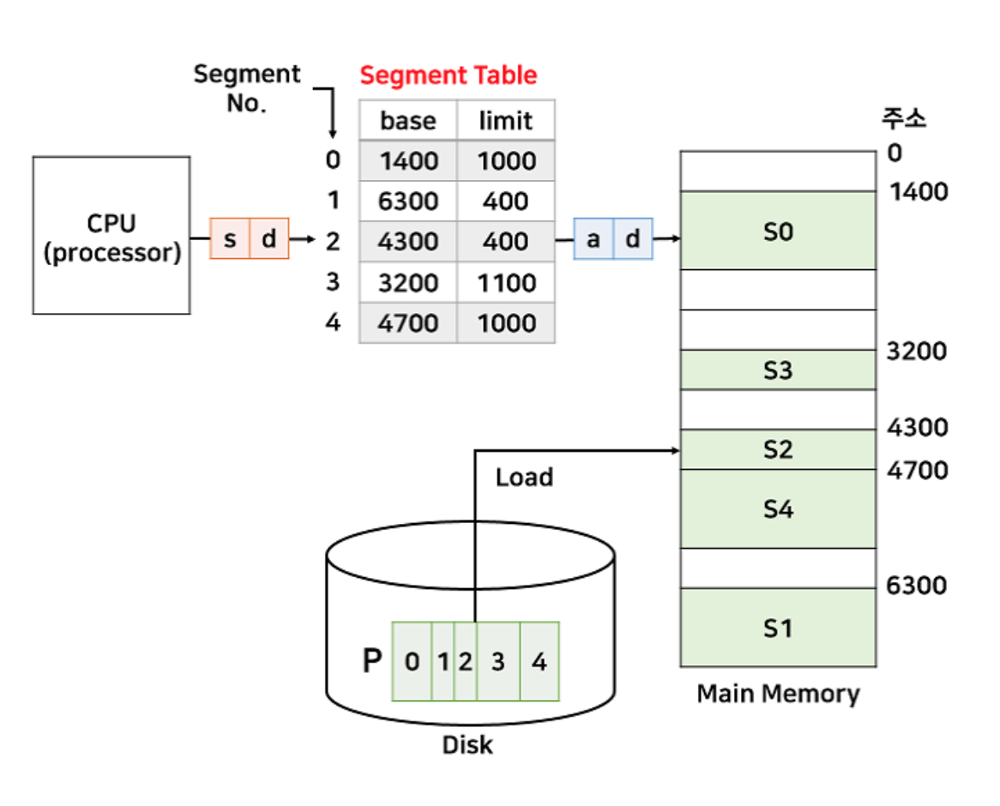
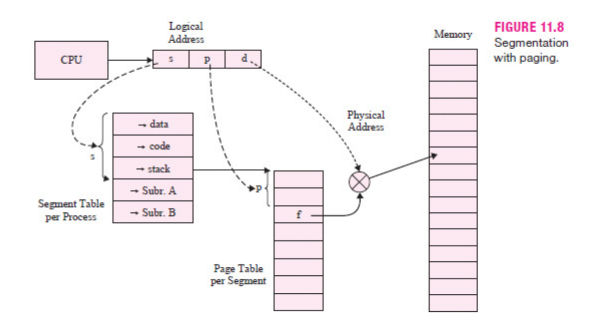

# 세그먼테이션(Segmentation)
- 프로스를 논리적 내용을 기반으 나ㅓ서 메모리에 배치하는 것을 의미
- 프세스를 세그먼트의 집합으로 표현
- 물리적인 크기가 아닌, 논리적 내용(같은 의미 단위)로 자르기 때문에 크기가 다르다.
  
## 세그먼테이션 원리

- 위 그림은 세그먼트 테이블과 프로세스가 메모리에 할당된 모습
- 세그먼테이션을 위한 세그먼트 테이블이 존재
- 세그먼트 테이블은 세그먼트 시작 번호와 시작 주소(base)와 크기(limit)를 가진다
  
## 세그먼테이션의 단점
- 세그먼트는 크기가 고정되어있지 않고 가변적이라, 외부 단편화 문제가 발생할 수 있다

## 세그먼테이션의 장점
- 보호와 공유의 기능면에서 장점을 가진다
### 보호
- 세그먼테이션은 r/w/x 권한을 테이블에 추가할 때, 논리적으로 나누기 때문에  해당 비트 설정하기 간단하며 안전하다
- r/w/x비트를 만들어 해당 세그먼트에 대한 접근 제어를 가능하게 한다
- 페이징은  code/data/stack 영역을 일정한 크기로 나누기 때문에  영역이 섞여 비트 설정이 까다롭다
### 공유
- 페이징은 영역이 섞일 가능성이 있지만, 세그먼테이션은 정확히 영역을 나누므로 효율적으로 공유
- 같은 프로그램을 사용하는 프로세스가 여러 개이면, 메모리에 하나만 적재해  세그먼트 테이블의 코드영역이 같은 곳을 가르킨다.

## 페이징 + 세그먼테이션

- 세그먼테이션은 보호와 공유면에서 효과적이고 페이징은 외부 단편화 문제 해결에 효과적이다
- 이 두가지의 장점을 모두 취하는 세그먼트 페이징 방식이 있다

### 세그먼테이션 후 페이징
- 프로세스를 세그먼트 단위로 자른다
  - 의미 있는 단위로 나누면 보호와 공유 측면에서 이점을 가질 수 있다
  - 단 여기까지, 외부 단편화가 발생할 수 있다
- 잘라진 세그먼트를 다시 일정 간격인 페이지 단우로 자르는 페이징 방법을 취한다
- 메모리에 적재하면 페이징의 일정 단위로 잘렸기 때문에 외부 단편화가 발생하지 않는다
- 단, 테이블을 두 가지를 모두 거쳐야하므로 속도 면에서 조금 떨어질 수 있다
