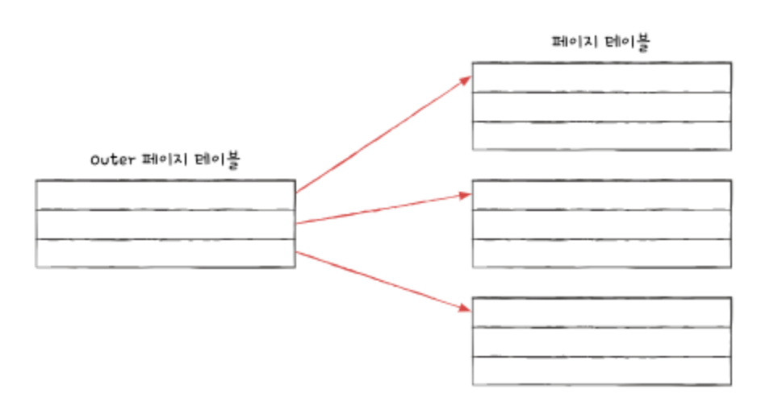
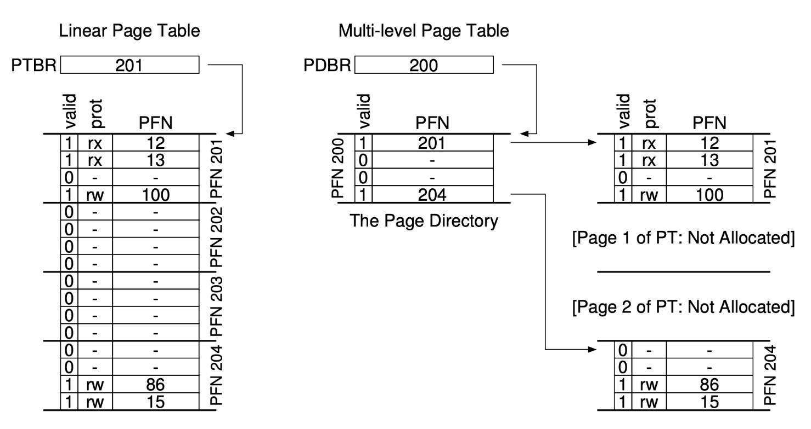
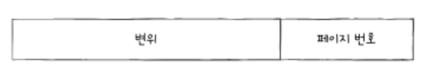
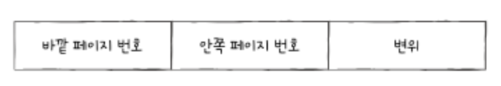
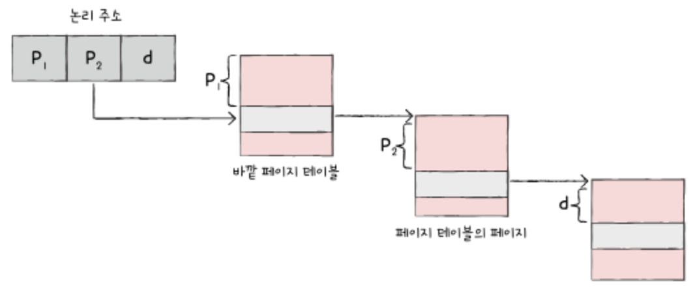

# SmallerTable
- 페이지 테이블의 크기는 생각보다 크다
- 프로세스의 크기가 크면 자연스럽게 페이지 테이블의 크기도 커진다
- 모든 페이지 테이블 엔트리를 메모리에 두는 것은 메모리 낭비
- 기존 페이지 테이지 테이블의 크기를 더 작게 만드는 방법
## MultlLevel Page Table

- 다단계 페이지 테이블 or 계층적 페이징 기법이라고 한다
- 페이지 테이블을 여러 개의 페이지로 나누고 바깥 쪽의 페이지 테이블을 하나 더 두는 방식

- 계층적 구성하면 모든 페이지 테이블을 메모리에 유지할 필요가 없다
- 몇 몇 페이지 테이블들은 보조기억 테이블에 있어도 무관

## MultlLevel Page Table에서 주소 변환
### 기존 페이지테이블에서 주소 변환

- 어떤 페이지 or 프레임에 접근하고 싶은가(변위)
- 접근하려는 주소가 페이지 or 프레임으로부터 얼마나 떨어져있는가(페이지 번호)
### MultiLevel Page Table에서 주소 변환

- 다단계 페이지 계층이 늘어날수록 페이지 폴트 발생 시 메모리 참조가 많아질 수 있다

