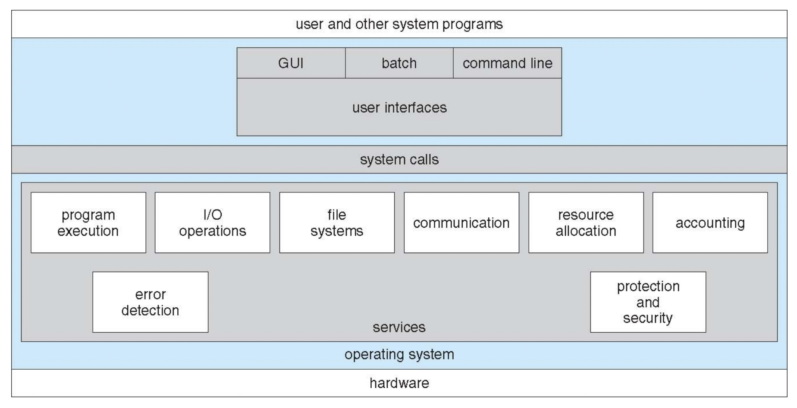
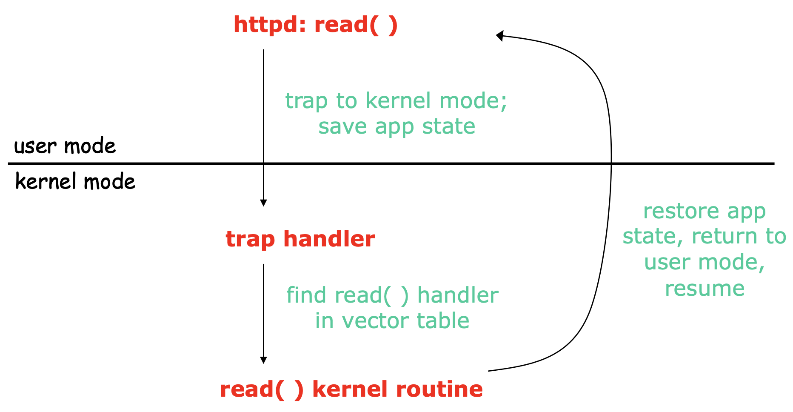
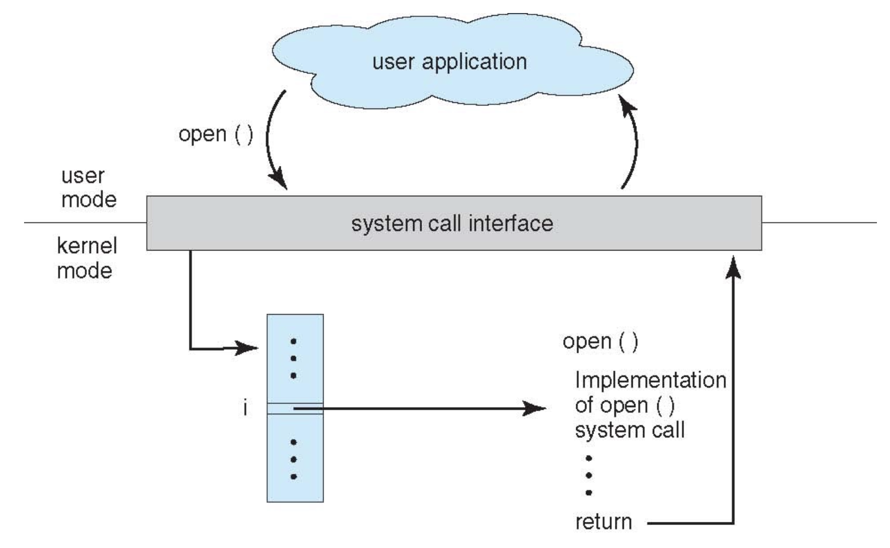
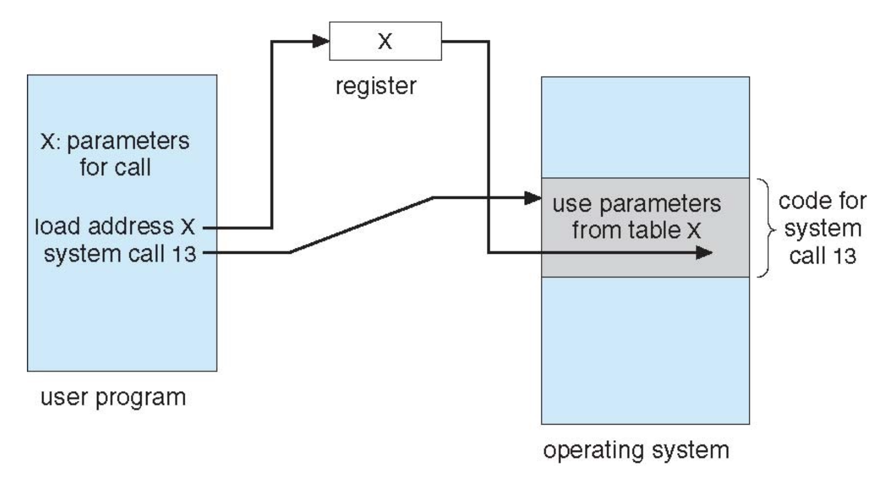

# 시스템 콜 (System Call)

## 1. 시스템 콜 (System Call)

- kernel mode의 기능을 user mode에서 사용할 수 있도록 하는 것이다.

    - User mode (사용자 모드) : **프로세스가 CPU를 점유**하고 있는 모드이다.

    - Kernel mode (커널 모드) : **운영체제가 CPU를 점유**하고 있는 모드이다.

    - Dual mode : User mode와 Kernel mode를 왔다갔다 하는 것이다.

- 프로세스가 하드웨어 자원에 접근하기 위해서는 직접 접근하는 것이 아니라 커널을 통해 접근해야 한다. **kernel mode의 기능을 사용하기 위해 kernel을 호출**하는 것이 바로 시스템 콜이다.

- 즉, **user mode에서 kernel mode로 전환**하기 위해 system call을 이용하는 것이다.

### (1) System call의 진행 과정 예시

- User program이 I/O 작업을 필요로 하는 경우, user program은 I/O 작업을 요청하는 함수를 호출해야 한다. I/O 작업을 수행할 수 있는 권한은 운영체제가 가지고 있기 때문이다.

- 이 함수는 운영체제 안에서 구현되어 있으므로 이 함수를 실행시키기 위해서는 먼저 운영체제가 실행되어야 한다. 이를 위해서 software interrupt인 trap이라는 동작이 수행된다.

- Trap이 일어나면 user mode에서 kernel mode로 전환되고, 아까 호출한 함수를 찾아내어 user program이 요청한 I/O 작업을 수행하기 시작한다. 동시에 작업을 요청한 user program은 waiting 상태로 전환되어 I/O 작업이 끝나기를 기다린다.

- I/O 작업이 끝나면 hardware interrupt가 발생하여 kernel mode로 전환되고, I/O 작업에 대한 후처리를 진행한다.

- 이후 I/O 작업이 끝날 때까지 대기하고 있었던 user program의 스케줄이 돌아오면 해당 user program이 이어서 동작하게 된다.

### (2) System call 처리를 위한 vector table

- 이러한 system call들을 운영체제에서 관리하기 위해 vector table을 만들어놓는다.

- 자주 사용되는 system call일수록 0번부터 앞쪽 번호로 부여되어 있으며, 각각의 system call마다 번호를 붙여놓은 vector table을 통해서 system call들을 빠르게 처리할 수 있게 된다.

- 예를 들어 0번에는 open(), 1번에는 read(), 2번에는 write(), 3번에는 close() 등이 부여되어 있는 것이다.

- trap(software interrupt)에 해당되는 system call 이외에도 interrupt(hardware interrupt)에 해당되는 vector table 또한 미리 만들어져 있다. 예를 들어 interrupt에 해당되는 vector table에는 0번에는 timer interrupt, 1번에는 DMA(Direct memory access), 2번에는 keyboard, 3번에는 mouse 등으로 번호가 붙여져 있는 것이다.

- 이러한 vector table들을 통해 function body에 빠르게 접근하여 system call을 빠르게 수행할 수 있다.

### (3) System call의 유형

- 프로세스 제어 (process control)

    - 끝내기 (end), 중지 (abort)

    - 적재 (load), 실행 (execute)

    - 프로세스 생성 (create process)

    - 프로세스 속성 획득과 설정 (get process attribute and set process attribute)

    - 시간 대기 (wait time)

    - 사건 대기 (wait event)

    - 사건을 알림 (signal event)

    - 메모리 할당 및 해제 (malloc, free)

- 파일 조작 (file manipulation)

    - 파일 생성 (create file), 파일 삭제 (delete file)

    - 열기 (open), 닫기 (close)

    - 읽기 (read), 쓰기 (write), 위치 변경 (reposition)

    - 파일 속성 획득 및 설정 (get file attribute and set file attribute)

- 장치 관리 (device management)

    - 장치를 요구 (request devices), 장치를 방출 (release device)

    - 읽기 (read), 쓰기 (write), 위치 변경 (reposition)

    - 장치 속성 획득 및 설정 (get device attribute and set device attribute)

    - 장치의 논리적 부착 및 분리 (attach, detach)

- 정보 유지 (information maintenance)

    - 시간과 날짜의 획득 및 설정 (time, date)

    - 시스템 데이터의 획득 및 설정

    - 프로세스 파일 및 장치 속성의 획득 및 설정

- 통신 (communication)

    - 통신 연결의 생성 및 제거

    - 메시지의 송신 및 수신

    - 상태 정보 전달

    - 원격 장치의 부착 및 분리
