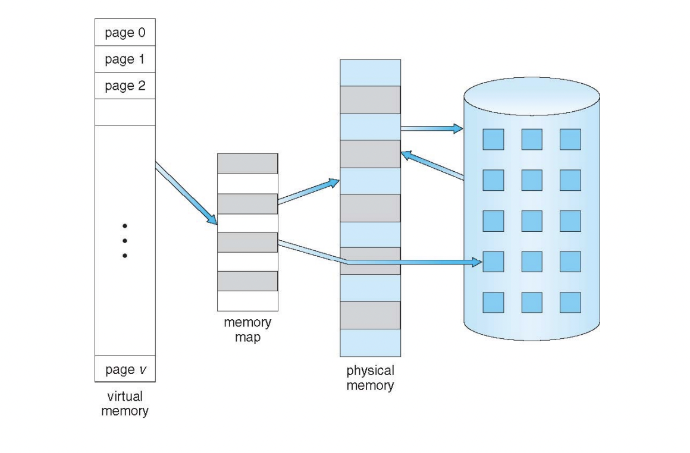
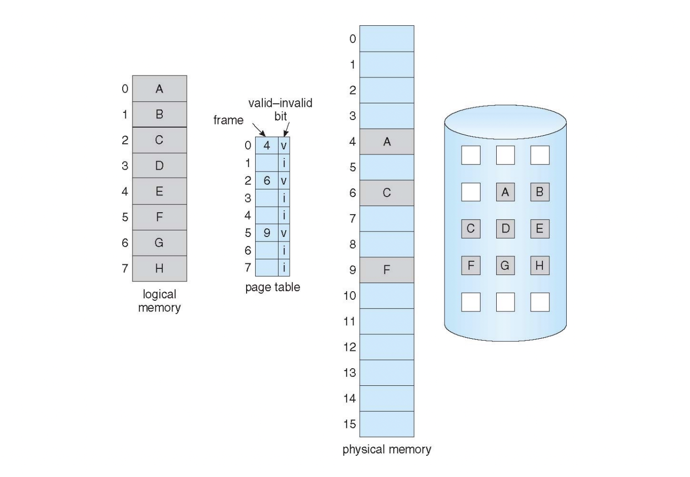
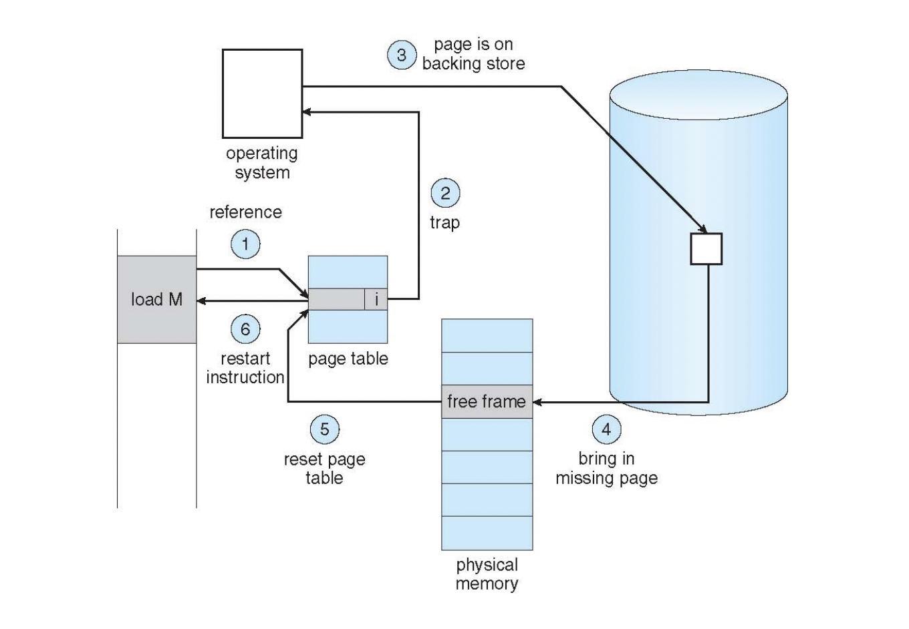
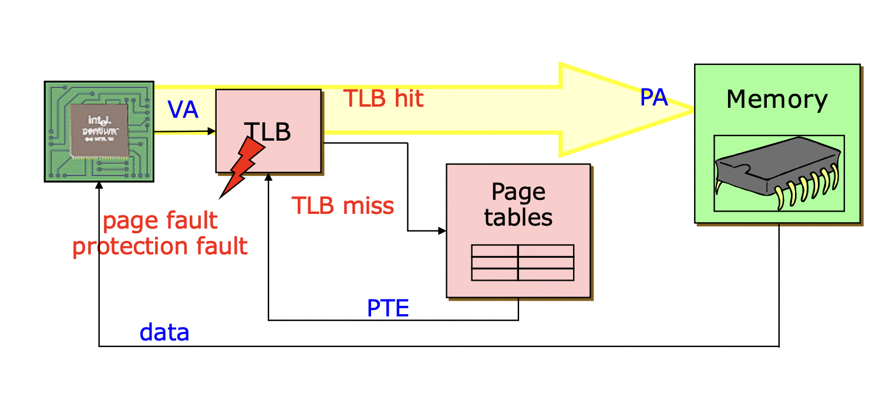
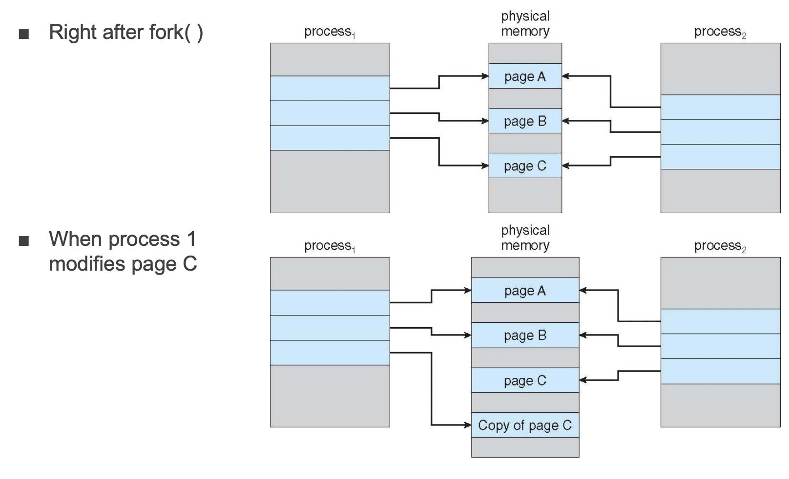
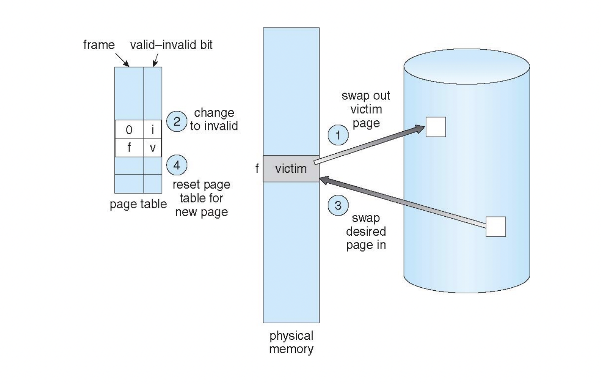
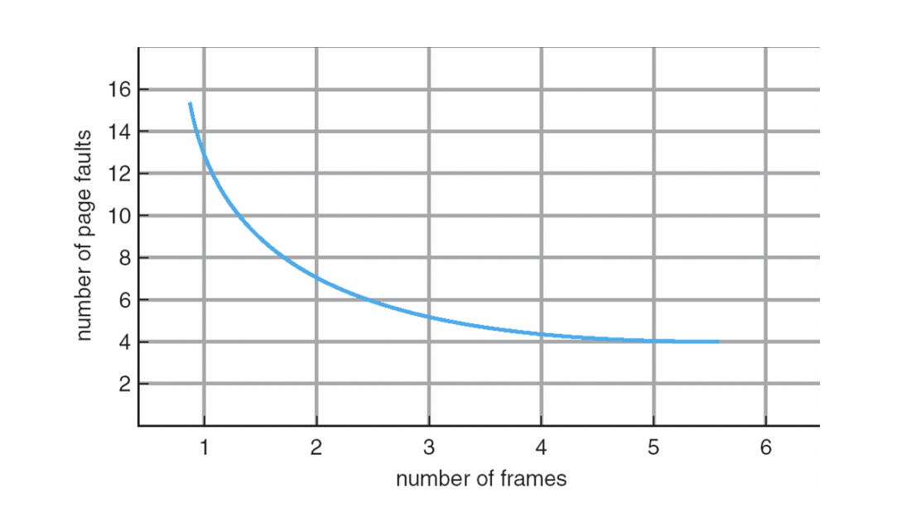
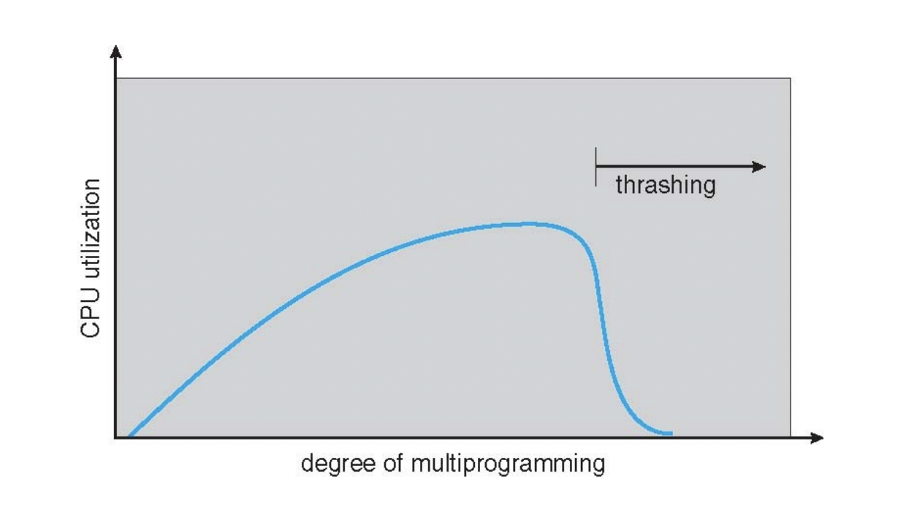

# 가상 메모리 (Virtual Memory)

## 1. 가상 메모리 (Virtual Memory)

- 메모리가 실제 메모리보다 많아 보이게 하는 기술이다.

    - 물리 메모리는 컴퓨터에 장착된 실제 메모리를 의미하는 것으로, 물리 메모리의 크기는 제한되어 있다.

- 어떤 프로세스가 실행될 때 메모리에 해당 프로세스 전체가 올라가지 않더라도 실행이 가능하다는 점에 착안하여 고안된 메모리 기법이다.

    - 원래라면 물리 메모리보다 큰 프로세스를 실행시킬 수 없지만, 가상 메모리를 이용하면 물리 메모리보다 큰 프로세스도 실행시킬 수 있다. 결국 가상 메모리는 사용자나 응용 프로그램에게 무한대의 메모리가 있다고 느끼도록 하는 것이다.

- 가상 메모리는 무한대만큼의 용량을 가진 것처럼 사용할 수 있다는 장점을 가지고 있다. 이것이 가능한 이유는 디스크의 일부분을 메모리의 일부분으로 사용하고 있기 때문이다.

- 만약 새로운 프로세스를 메모리에 올려야 하는데 free frame이 없는 경우에는 물리 메모리에 있는 프로세스 하나를 disk로 내려보낸 다음에 free frame을 확보하여 process에게 할당해주어야 한다. 즉, physical memory와 second storage 사이에서 swap이 일어나게 된다.

## 2. Demand Paging

- Demand paging 기법은 **page에 대한 요청이 있을 때 그 page를 메모리에 올리는 기법**이다. 즉, 프로세스가 실행될 때 모든 page를 처음부터 메모리에 다 올려서 사용하는 방식이 아니라 필요한 page만 그때그때 메모리에 올려서 사용하는 방식이다. page에 최초로 access할 때 메모리로 swap in하는 것이다.

- 프로그램 전체를 메모리에 올리고 내렸던 예전 방식에서 demand paging 기법으로 발전하게 되었다.

- 이렇게 가상 메모리가 발전함에 따라 현재에는 long-term scheduler(disk에서 memory로 swap in)와 medium-term scheduler(memory에서 disk로 swap out)가 사라지게 된 것이다.

### (1) 장점1 - 메모리 절약 및 효율적

- 프로세스가 실행되면서 분기 작업 등을 거치다보면 한 프로세스 내에서도 실행되는 코드와 실행되지 않는 코드가 존재하게 된다.
- 이러한 점 때문에 처음부터 모든 page를 메모리에 올리는 방식에서는 메모리 낭비로 이어질 수 있다는 단점이 있고, 또한 프로세스가 처음 실행될 때 모든 page를 메모리에 올린다면 프로세스 처음 실행 시에 이로 인한 성능 저하가 생길 수 있다는 단점이 있다.

### (2) 장점2 - Locality 특성을 극대화

- Demand paging 기법에는 메모리를 아끼기 위해서라는 이유도 있지만, locality 특성도 demand paging 기법을 사용하는 이유 중 하나이다.
- 일반적인 코드의 경우 초기화와 반복 작업들을 수행하는 작업들로 이루어져 있는 만큼 locality 특성을 가지고 있다.
- Locality 특성은 computer system에서 두드러지게 나타나는 특성이다. Demand paging 기법을 통해 필요한 부분만 그때그때 올려서 사용하면서 이러한 locality 특성을 극대화할 수 있게 되었다.

> 💡 Locality
> 
> - Temporal locality : 최근에 참조된 위치는 곧 다시 참조될 가능성이 높다. (시간적)
> - Spatial locality : 최근에 참조된 위치 근처의 위치는 곧 참조될 가능성이 높다. (공간적)

### (3) Paging에서의 메모리 보호

- Page table에서는 접근하려고 하는 page가 valid인지 invalid인지를 구분하기 위해 **valid-invalid bit**를 사용하고 있다.

- valid-invalid bit가 valid이면 해당 page가 memory에 존재하고 있는 것이고, invalid라면 memory에 존재하지 않는 것이다.

- valid-invalid bit가 invalid인 경우는 다시 2가지의 case로 나누어지는데, 바로 page fault와 protection fault이다.

- Page fault : 참조하려는 page가 아직 memory에 load되지 않아서 disk에 있는 것을 참조한 경우

- Protection fault : 아예 참조할 수 없는 메모리를 참조한 경우

### (4) Page fault 처리 과정

- 접근하려고 하는 page가 invalid인 경우에는 trap(exception)을 발생시켜서 운영체제를 호출하게 되고, 운영체제는 이것이 page fault인지 protection fault인지 여부를 판단한다.

- Page fault인 경우 운영체제는 해당 page를 디스크에서 물리 메모리로 다시 가져오고 free frame에 할당한다. 이후 page table을 reset하고 page fault로 인해 수행되지 못했던 명령어을 재실행하게 된다.

### (5) 메모리를 참조하는 과정

- CPU가 특정 메모리 영역을 참조하려고 하는 경우, CPU 내 MMU에 있는 TLB를 우선 확인한다.

- TLB hit의 경우에는 접근하려고 하는 page가 이미 물리 메모리에 load가 되어있다는 의미이므로 바로 메모리에 접근할 수 있다.

- TLB miss가 나는 경우에는 메모리에 있는 page table을 참조하게 된다. 여기서 접근하려고 하는 page가 valid인 경우에는 TLB 캐시를 업데이트하고 작업을 다시 수행하여 TLB hit으로 메모리에 접근하게 된다.

- 만약 page table을 참조했는데도 invalid인 경우라면, 이는 page fault 또는 protection fault 둘 중 하나에 해당하는 상황이므로 CPU가 자기자신에게 interrupt를 걸고 운영체제를 호출하여 page fault인지 protection fault인지 여부를 확인하게 된다.

- 프로세스가 context switching이 되면 TLB가 모두 초기화되므로 TLB miss가 많이 발생하게 되는데, 이렇게 cache miss가 많이 일어나는 상황을 cold cash라고 한다.

- TLB hit이 나는 case가 99% 이상이므로 대부분의 case에서는 TLB hit이 난다고 생각할 수 있으며, 극히 드문 경우에서 TLB miss가 나게 되는 것이다. 프로세스 실행 처음(또는 context switching 직후)에는 TLB miss가 많이 나게 되므로 버벅임을 잠시 느낄 수 있지만, 일정 시간 이후에는 대부분 TLB hit이 일어나기 때문에 버벅임이 발생하지 않게 된다.

### (6) Copy-on-Write

- 해당 프로세스를 그대로 복제한 프로세스를 하나 더 만드는 명령어인 `fork()` 를 수행한 이후, 새로 만들어진 프로세스는 물리 메모리에 있는 page들을 하나 더 복사하지 않고 원래 프로세스의 page들을 그대로 공유해서 사용한다. 프로세스를 똑같이 만드는 것인데 똑같은 page들을 굳이 하나 더 만들 필요가 없기 때문이다. 시간이 지남에 따라 각각의 프로세스가 수행할 코드도 달라질 것이고 데이터들도 달라지게 되는데 이때 해당 page를 복사하여 사용하게 된다. 즉 `fork()` 로 프로세스가 복제될 때 page들을 한번에 복사하는 방식이 아니라 초기에는 공유하여 사용하다가 필요한 부분부터 복사하여 따로 사용하는 방식인 것이다.

- 일반적으로 `fork()` 를 실행한 다음에 `exec()` 을 실행하는 순서인데, 이때에도 한번에 모든 코드를 다 올리는 것이 아니라 demand paging 기법으로 필요한 부분부터 올리는 것이므로 많은 성능 개선이 있다는 장점이 있다.

## 3. Page Replacement

- 물리 메모리가 다 사용되고 있는 상황에서 새로운 page를 메모리에 올려야 할 경우, 기존에 있던 page들 중에서 하나를 선정하여 디스크에 백업하고 그 공간에 덮어쓰기를 해야 하는데, 이를 page replacement라고 한다. victim page를 디스크로 내리고 invalid로 바꾼 다음 필요한 page를 swap in하고 page table을 업데이트하게 된다.

- 이러한 page replacement 과정은 disk에 write하고 read까지 해야 하는 I/O 작업이기 때문에 느릴 수 밖에 없다. victim을 잘못 선정할 경우에는 이러한 I/O 작업의 횟수가 증가하여 system 전체의 성능 하락으로 이어질 수 있다. 이 때문에 어떤 page를 victim으로 삼을 것인지가 가장 중요한 문제가 된다.

- 즉, page fault 횟수를 가장 적게 발생할 수 있도록 하는 것이 바로 page replacement의 목표라고 할 수 있다. 성능을 향상시키기 위해서는 page fault rate을 줄여야 하는데, 그래프의 결과를 보면 할당받은 frame의 개수가 많을수록 page fault 횟수는 줄어든다는 사실을 확인할 수 있다. 또한 할당받은 frame의 개수가 특정 개수 이상이면 page fault가 일어나는 횟수가 차이가 거의 없다는 사실도 함께 확인할 수 있는데, 이는 locality라는 특성 때문에 일정 개수 이상에서는 차이가 거의 나지 않게 되는 것이다. 이 결과를 통해 frame의 개수를 5~6개로 유지하는 것이 적절하다는 결론을 얻을 수 있다. 미래를 예측하는 것은 불가능하기 때문에 locality라는 특성을 최대한 활용하여 victim을 잘 결정하는 것이 무엇보다 중요할 것이다.

## 4. Thrashing

- 동시에 동작하는 프로세스의 수가 늘어나면 CPU 사용률도 같이 linear하게 늘어나게 된다. 그런데 동시에 동작하는 프로세스의 개수가 특정 개수 이상에서는 CPU 사용률이 아직 maximum에 도달하지 않았음에도 뚝 떨어지게 되는 현상이 일어나게 되는데, 이러한 현상을 thrashing이라고 한다. 이러한 현상은 locality의 총량이 물리 메모리의 총량보다 더 커지는 경우에 발생하게 된다. 물리 메모리가 무한하지 않으므로 page replacement가 일어나게 되는데 locality의 총량이 물리 메모리의 총량보다 더 클 때에는 swap out과 swap in을 계속 반복하게 되므로 overhead가 커지게 되기 때문이다.

- 결국 thrashing을 줄이기 위해서는 물리 메모리의 용량을 늘리거나 또는 동시에 동작하는 process의 수를 줄여야 한다.

