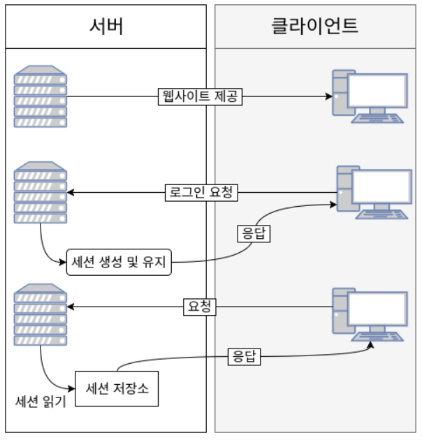
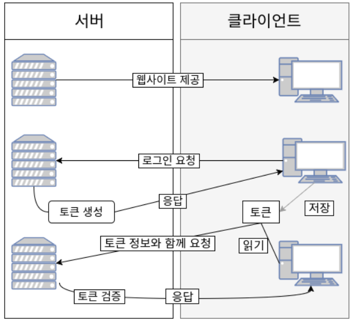

# 사용자 인증 방식


## 1. 서버 인증 방식



- 유저가 로그인을 하면 서버 메모리 상에 세션 저장, 클라이언트의 브라우저 쿠키로 Session Id 저장하게 함
- 사이트에 대한 모든 요청에 Session Id를 쿠키에 담아 전송
- 클라이언트 수가 많아지면 서버에 저장해야 할 정보가 많아져 메모리/DB 상 부하 가능성이 높아짐
- 또한 세션 저장소는 로드밸런싱했을 때 공유되지 않음, 따라서 여러 대의 서버를 사용하게 될 때 동일한 사용자더라도 인가가 불가능하다는 단점이 존재함
- 세션 ID 자체는 유의미한 개인 정보를 다루지 않으므로 **보안성**이 좋은 방식

## 2. 토큰 인증 방식



- 세션에 저장하는 것이 아닌, 토큰을 클라이언트에게 전달해 저장하게 함
- But, 토큰은 발급했다는 사실을 저장하지 않아 탈취의 위험이 존재함
- 토큰의 종류
    - access token : 서버 API를 직접 요청할 때 사용, 짧은 주기
    - refresh token : 액세스 토큰이 만료되었을 때 엑세스 토큰을 재발급할 목적으로 사용, 긴 주기
    - 서버와 클라이언트 통신 중 토큰이 탈취당할 위험이 있기 때문에 분리
- 몇 만명의 인증 방식을 저장하고 있지 않기 때문에, 가볍고 **확장성**이 좋은 방식

# JWT란?

- Json Web Token
- 주로 상태를 유지하지 않는 RESTful API에서 사용자 인증을 위해 사용
- 정보를 JSON 형태로 안전하게 전송하기 위한 웹 표준 (RFC7519)
- 디지털 서명이 되어 있으므로 신뢰할 수 있음
    - 디지털 서명 : 내가 암호키를 사용해 값을 변경하는 것
    - 그러면 전달 받은 사람도 같은 키를 가지고 있다가 다시 서명을 만들어 봄
    - 목표했던 값이 나온다면 위조하지 않았다는 것 증명
- 암호화 알고리즘을 사용
- JWT 자체가 필요한 모든 정보를 갖고 있기 때문에 검증하기 위한 다른 검증 수단이 필요하지 않음
- 권한을 부여하거나 정보를 교환할 때 등의 상황에서 사용 가능

## 왜 사용하는가?

HTTP는 기본적으로 state-less 지향함

즉, 서버-클라이언트 구조에서 서버가 클라이언트의 상태를 가지고 있지 않음

- 장점 1: 서버의 확장성이 높으며 대량의 트래픽이 발생해도 대처할 수 있음
- 장점 2: (서버가 분리되어 있는 경우) 특정 DB/서버에 의존하지 않아도 인증할 수 있음
- 단점 1: state-ful 방식보다 비교적 많은 양의 데이터가 반복적으로 전송되므로 네트워크 성능저하가 될 수 있음
- 단점 2: 데이터 노출로 인한 보안적인 문제 존재

### JWT의 단점 보완

1. 데이터 압축: 사용자 인증에 필요한 모든 정보는 토큰 자체에 포함하기 때문에 별도의 인증 저장소 필요 X

2. 디지털 서명을 통한 보안 강화

## JWT 구성

_Header.Payload.Signature_

.(dot)을 구분자로 하여 JWT 토큰 하나를 구성

### 1. Header

- **토큰 타입, 암호화 알고리즘** 명시
```
{
  "alg": "HS256",
  "typ": "JWT"
}
```

### 2. Payload

- JWT에 넣을 **데이터**
- JWT에 담기는 데이터 한 조각을 claim이라고 하며, 각 claim은 key : value로 구성
- claim 종류
    - registered : 서비스에서 필요한 정보들이 아닌, 토큰에 대
한 정보들을 담기 위해 이미 정해진 이름
    - public : 충돌 방지된 이름 보유, 클레임 이름을 URI 형식으로 저장
    - private : 클라이언트와 서버 사이 협의 하에 사용되는 이름
- 단, Payload는 서명된 파트가 아니며 단순 Base64 인코딩임
- 따라서 누구나 열람이 가능하므로 중요 정보는 담아선 안됨

```
{
  "sub": "1234567890",
  "name": "John Doe",
  "iat": 1516239022
}
```

### 3. Signature
- 디지털 서명 파트로 헤더, 페이로드가 **변조되었는지** 확인하는 역할
```
HMACSHA256(
  base64UrlEncode(header) + "." +
  base64UrlEncode(payload),
  secret //  유저가 지정하는 비밀코드
)
```

## 인증 실습
[JWT 공식 홈페이지](https://jwt.io/)