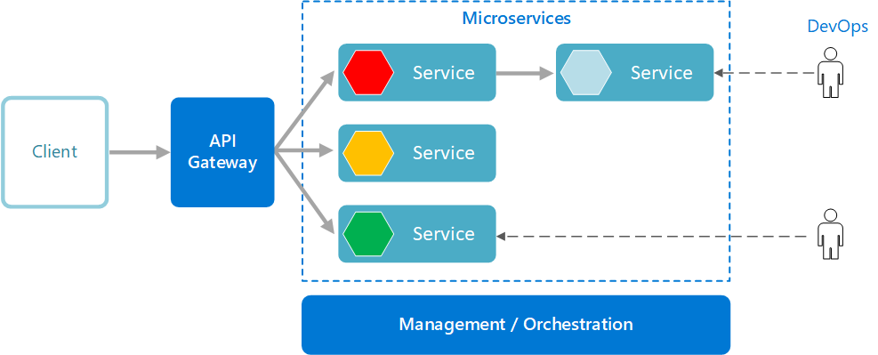

# 마이크로서비스 아키텍처 (MSA, Microservice Architecture)

## 1. 모놀리식 아키텍처 (Monolithic Architecture)

- 모놀리식 아키텍처는 **소프트웨어의 모든 구성요소가 하나의 프로젝트로 통합되어 있는 구조**로, 모든 기능이 하나의 프로젝트에 통합되어 개발되고 배포된다.
- 구조가 단순하기 때문에 **소규모 프로젝트에서 주로 사용**된다.
- 하지만 모놀리식 아키텍처에서는 **프로젝트의 규모가 커진다면 유지보수와 확장에 어려움이 발생한다.**

### (1) 장점

- **초기 개발에 유리**하며, 빠르게 프로토타입을 개발할 수 있다.
- 단일 코드베이스로 구성되기 때문에 **통합 테스트와 빌드 과정이 간단할 수 있다.**
- 필요한 모든 기능을 한 번만 호출하기 때문에 복잡한 통신 없이 직접 사용할 수 있다.

### (2) 단점

- 코드 베이스가 커질수록 복잡해지고 유지관리 및 확장이 어려워진다.
- **일부 기능을 수정하거나 업데이트하려면 전체 어플리케이션을 다시 배포해야 한다.**
- **특정 기능에 장애가 생기면 전체 어플리케이션에 영향을 줄 수 있다.**

## 2. 마이크로서비스 아키텍처 (MSA, Microservice Architecture)

- MSA는 기존 모놀리식 아키텍처의 문제를 해결하기 위해 고안되었다.
- MSA는 어플리케이션을 **여러 개의 작은 독립적인 서비스들의 집합으로 구성**하는 아키텍처 패턴이다.
- **각 서비스는 특정 비즈니스 기능을 담당**하며, 독립적으로 개발과 테스트, 배포, 유지보수가 이루어진다.
- 각 서비스는 **독립적으로 배포하고 확장할 수 있다.**
- 각 서비스는 자체 데이터베이스를 사용할 수 있어 **데이터 관리의 자율성이 증가한다.**

- 이미지 출처 : https://learn.microsoft.com/ko-kr/azure/architecture/guide/architecture-styles/microservices

### (1) 특징

- MSA에서는 API를 통해서만 상호작용할 수 있다.
- 서비스의 end-point(접근점)를 API 형태로 외부에 노출하고, 실질적인 세부 사항은 모두 추상화한다.
- MSA는 서비스 간의 상호작용을 위해 경량의 프로토콜(예를 들어 HTTP, 메시지 큐)을 사용하며, 이를 통해 **서비스 간 결합도를 낮추고 각 서비스의 자율성을 높인다.**

### (2) 장점

- 서비스별로 **독립적인 배포와 확장**이 가능하다. 따라서 개발 주기와 배포 주기를 빠르게 가져갈 수 있고, 지속적인 배포도 기존 모놀리식에 비해 가볍게 할 수 있다.
- **일부 서비스에 장애가 발생하더라도 전체 시스템에 큰 영향을 미치지 않는다.** 또한 각 서비스의 부하에 따라 개별적으로 scale-out이 가능하다.
- 각 서비스에 대해 가장 적합한 언어나 프레임워크를 사용할 수 있으므로, **개발의 유연성**이 높아지고 팀 단위로 기술 스택을 다르게 가져갈 수 있다.
- **각 서비스가 명확히 분리된 책임**을 가지기 때문에, **유지보수가 쉬워지고 각 팀이 독립적으로 작업할 수 있다.**

### (3) 단점

- **초기 개발 및 통신에 시간이 소요될 수 있다.**
- 서비스가 많아질수록 **서비스 간의 통신이 복잡해진다.** 서비스가 모두 분산되어 있기 때문에, 내부 시스템의 통신을 어떻게 가져가야 할지 정해야 한다.
- **데이터 일관성을 유지하는 데 어려움을 겪을 수 있다.** 통신 장애와 서버 부하가 있을 경우에는 어떻게 트랜잭션을 유지할지 결정하고 구현해야 한다.
- **각 서비스가 개별적으로 로그를 관리하고 모니터링해야 한다.** 이를 위해 통합적인 로깅 및 모니터링 도구가 추가로 필요할 수 있다.
