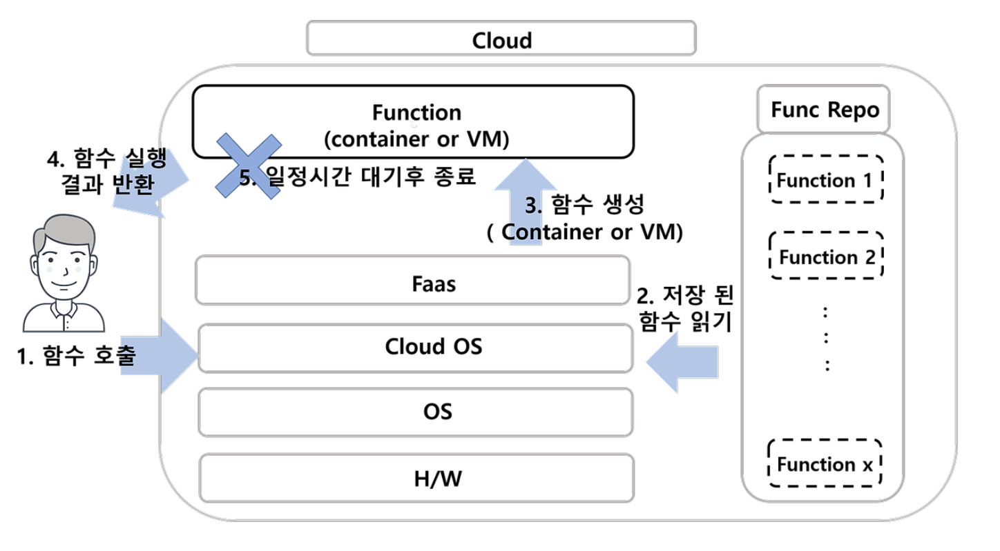
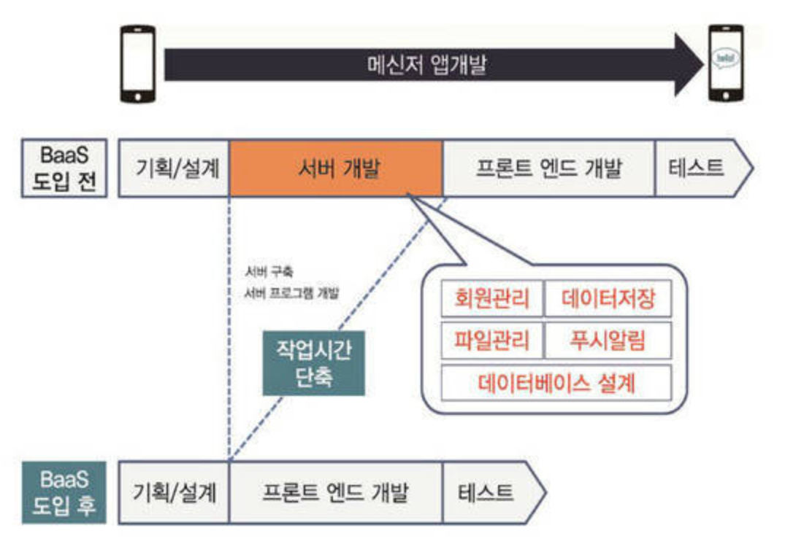

# Serverless Architecture(서버리스 아키텍처)

## 서버리스란?
- Server(서버) + Less(리스)의 합성어
- 서버리스는 클라우드 컴퓨팅 모델 중 하나
- 이름으로는 서버가 없다라고 해석할 수 있지만 그건 아니다
- 개발자가 직접 서버를 관리하지 않아 신경 쓸 필요없는 경우

- ### 사용자가 없다면 자원을 할당하지 않고 대기하다 요청이 들어오면 자원을 할당해 요청을 처리하고 다시 대기상태로 돌아간다.

## 예를 들어..
- 서버의 사용자가 10000명라 예상하고 맞는 용량의 서비를 구입
- 이 경우, 사용자가 0 ~ 10000명이든 같은 금액을 낸다.
- 즉, 크고 작은 손실을 일으킨다

# 구현 방식
- Baas와 Faas 두 가지 구현 방식으로 나뉘지만, 일반적으로 서버리스는 Fass를 의미
## FaaS (Function as a Service)
- AWS Lambda
- Microsoft Azure Function
- Google Cloud Functions ... 등
## BaaS (Backend as a Service) 
- Firebase
- Kinvey
- Parse ... 등

## Faas(Function as a Service)

- ### 함수를 서비스로 제공
- 함수는 프로그래밍 수준에서 함수 or 메소드등을 의미
- 용자가 작성한 코드(백엔드)를 서버리스 제공자의 서버에 업로드하면 해당 서버는 업로드한 코드를 함수 단위로 쪼개 대기상태
- 요청이 들어오면 서버가 대기상태에 두었던 함수를 실행시켜 처리한 후 작업이 끝나면 다시 대기상태로 만드는 구조

### Faas의 특징
#### (1) Stateless
- 함수가 실행되는 동안에만 관련된 자원을 할당,즉 함수가 항상 같은 머신에서 실행된다는 보장이 없다. 즉, 함수 실행 시 로컬에서 어떤 상태(State)가 유지될 수 없다.
- 해결하고 싶다면 메모리에 상태를 저장하지 않고 AWS의 경우 S3을 이용하거나 아예 DB를 사용

#### (2) Ephemeral
- 함수는 특정 이벤트가 발생했을 때만 컨테이너로서 배포되고, 실행이 끝난 후엔 자원이 회수되므로 일시적으로만 배포된다고 할 수 있다.

## Baas(Backend as a Service)
- 일반적으로 SPA, 안드로이드와 같은 클라이언트 중심으로 개발된 어플리케이션

- 앱 개발에 있어서 필요한 다양한 기능들 ( DB, SNS 김연동, 파일시스템 등)을 API로 제공
- 서버 개발을 하지 않고서도 필요한 기능을 쉽고 빠르게 구현 가능하게 하고, 비용은 api 사용량만큼만
- 대표적인 BaaS의 서비스중 하나인, Firebase

# 서버리스 장단점
## 장점
### (1) 비용절감
- 실제 사용량에 대해서만 청구
- AWS Lambda의 경우 100만번 실행 당 0.2달러
### (2) 애플리케이션의 품질에 집중 가능
- 개발하는 애플리케이션의 품질 향상에 좀 더 집중가능
### (3) 높은 가용성과 유연한 확장
- 요청이 들어올때만 실행되고 동적으로 자원을 할당하기 때문에 가용성 높다 - 스케일링에 신경 쓸 필요 없음
👨‍💻:티스토리]
### (4) 빠른 개발 배포

## 단점
### (1) Cold Start
- 서버가 항시 요청에 대기하고 있는게 아니다.
- 모가 커지거나 속도를 요구하는 프로젝트라면 서버리스는 좋은 선택이 아님

### (3) 클라우드 제공 플랫폼에 심하게 종속적
- IaaS, Paas 는 플랫폼을 바꾸는게 어렵지 않지만 서버리스는 구조자체를 바꾸는 거라 매움 어렵다

### (4) 로컬 데이터 사용 불가(Stateless)
- 서버리스는 무상태(Stateless)적인 기능으로 구현
- 하나의 작은 기능으로 나뉘어진 함수들은 요청마다 새로 기동되어 호출되기 때문에 전후 상태를 공유 불가
- 변수와 데이터의 공유가 불가. 즉, 데이터를 로컬 스토리지에서 읽고 쓸 수 없다. ( 서버리스 벤더에 따라 추가 서비스를 통해 극복이 가능하지만, AWS S3, Azure Storage등 일반적인 서버리스는 불가능하다.)